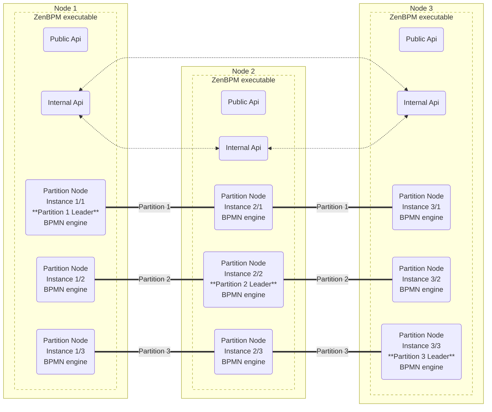
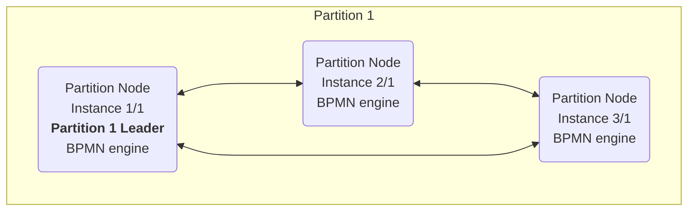
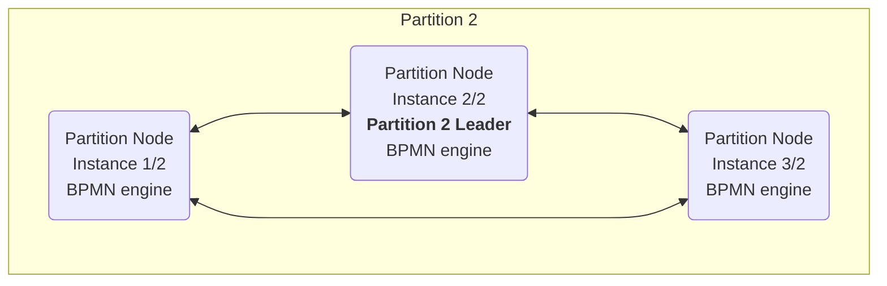
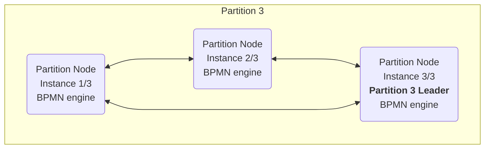

# Architecture Overview

ZenBPM is designed with a modular architecture that separates concerns and allows for flexibility and scalability. This document provides an overview of the system's architecture and its key components.

## High-Level Architecture

ZenBPM is built as a distributed system with the following main components:

1. **Core Engine**: The heart of the system that executes BPMN processes
2. **Storage Layer**: Manages persistence of process state
3. **API Layer**: Provides interfaces for external systems
4. **Cluster Management**: Coordinates distributed execution

## Cluster Diagram

ZenBPM raft cluster

Communication inside partitions

## Core Components

### BPMN Engine

The BPMN Engine is responsible for:

- Parsing and validating BPMN 2.0 process definitions
- Creating and managing process instances
- Executing process logic according to the BPMN specification
- Managing execution tokens and flow control
- Handling events, gateways, and tasks

The engine uses a token-based execution model where tokens flow through the process graph, activating elements as they are encountered.

### Storage Layer

ZenBPM uses **rqlite** as its storage backend, which provides:

- Distributed SQL database built on SQLite
- Strong consistency through the Raft consensus algorithm
- Durability of process state across node failures
- Horizontal scalability

### API Layer

The API layer provides interfaces for external systems to interact with ZenBPM:

- **REST API**: HTTP-based API following RESTful principles
- **gRPC API**: High-performance RPC framework for system-to-system communication

Both APIs provide similar functionality, allowing clients to:

- Deploy process definitions
- Start process instances
- Query process state
- Complete tasks
- Correlate messages

### Cluster Management

ZenBPM supports distributed execution through its cluster management component, which:

- Coordinates node discovery and membership
- Manages leader election
- Ensures consistency of distributed state
- Handles node failures and recovery

## Execution Model

ZenBPM follows a token-based execution model:

1. When a process instance is created, tokens are placed at all start events
2. Tokens flow through the process graph, activating elements as they are encountered
3. When a token reaches an activity, the activity is executed
4. After activity execution, tokens are generated on outgoing sequence flows
5. Gateways control the flow of tokens based on conditions or parallel execution
6. When a token reaches an end event, it is consumed
7. A process instance is completed when all tokens are consumed

## Observability

ZenBPM integrates with OpenTelemetry to provide:

- Distributed tracing of process execution
- Metrics for monitoring system performance
- Logging for debugging and auditing

This allows operators to monitor the health and performance of the system and troubleshoot issues.
