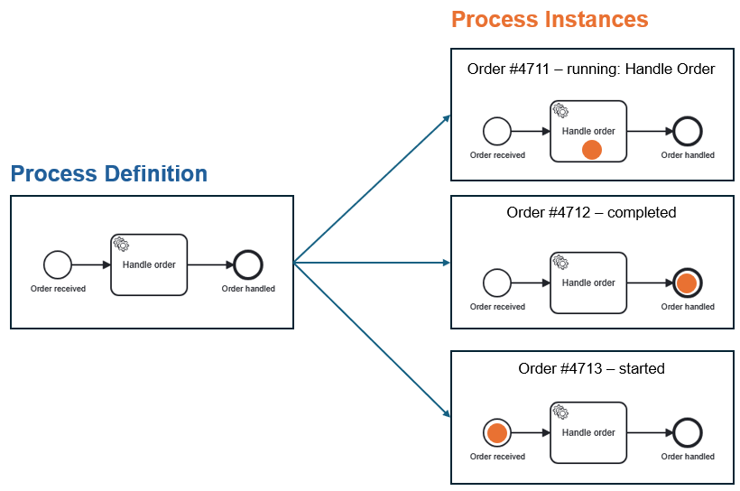
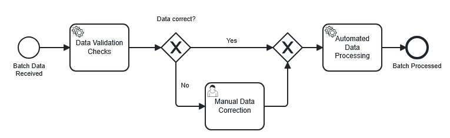
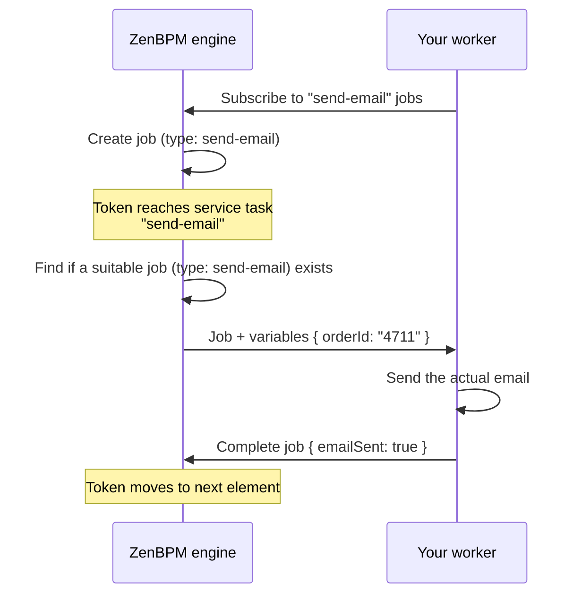

# BPM Concepts

This page explains the ideas behind ZenBPM. You don't need to read it before the [Getting Started tutorial](/tutorials/getting-started) - but whenever a term there feels unclear, this is the place to look it up.

If you already know Camunda, Zeebe, or another BPMN engine, skip to [How ZenBPM maps to other engines](#terminology-mapping).

## What is a process engine? {#process-engine}

Most software encodes business logic in code: *"when an order arrives, check the stock, charge the card, notify the warehouse."* That logic is real, but it's invisible - it is visible in the code, only readable by developers, scattered across services.

A **process engine** turns this logic inside out. You draw the flow as a diagram, hand it to the engine, and the engine executes it: it tracks where each order currently stands, calls your code at the right moments, waits for humans when a decision is needed, and remembers everything - even across restarts, or over days and weeks.

The major difference is that the diagram is not documentation *about* the system. It **is** the system. When the diagram changes, the behavior of the system changes.

ZenBPM is such an engine. It executes diagrams written in **BPMN 2.0** (Business Process Model and Notation), an ISO-standardized graphical language. Any BPMN modeling tool (the ZenBPM UI, bpmn.io, Camunda Modeler etc.) produces files ZenBPM can run.

## Process definitions and process instances {#definition-vs-instance}

This is the single most important distinction in BPM, and the one that is quite confusing for newcomer.

A **process definition** is the blueprint - the BPMN diagram you deploy to the engine. *"How we handle an order."* There is one per version of your process.

A **process instance** is one running execution of that blueprint. *"Order #4711 from Alice, currently being handled."* There can be thousands, each with its own state and data, each at a different point in the flow.

{/* Excalidraw source: definition-vs-instance.excalidraw — export as SVG (embed scene, transparent
    background) and check dark mode; use ThemedImage with a dark variant if needed. */}


The same relationship as a class and its objects, or a recipe and the meals cooked from it.

In ZenBPM, each deployed definition gets a unique `processDefinitionKey`, and each started instance gets a `processInstanceKey`. You start an instance from a definition; you monitor and interact with instances.

Definitions can have different versions: deploying a changed diagram with the same process ID creates a new version. Instances keep running on the version they started with - a week-long approval process won't break because you improved the diagram on yesterday.

## Tokens: how the engine tracks progress {#token}

Picture placing a coin on the start event of the diagram and moving it along the arrows. That coin is a **token**, and it marks where a process instance currently *is* - you can see them as the orange dots in the picture above.

When an instance starts, a token is created at the **start event**. It travels along **sequence flows** (the arrows), pauses at elements that wait for something (a human decision, an external system, a timer), splits into multiple tokens at parallel paths, and disappears when it reaches an **end event**. When no tokens remain, the instance is complete.

You never manipulate tokens directly - but the mental model explains almost everything the engine does: *"the instance is active"* means a token is sitting somewhere; the instance history is the audit trail the tokens left behind.

## The elements of a BPMN diagram {#bpmn-elements}

BPMN defines many symbols, but nearly every process is built from four families:



### Events {#events}

Circles. Something that *happens*: the process starts, a message arrives, a timer fires, the process ends. Thin circles start a process, thick ones end it, double circles occur in between.

### Tasks {#tasks}

Rounded rectangles. Something that gets *done* - a single unit of work. The two kinds you'll meet first:

- A **service task** is work done by software. The engine doesn't run your code itself; it creates a *job* and waits for a worker to complete it (see [Jobs and workers](#jobs-and-workers) below).
- A **user task** is work done by a person. The engine creates the task, someone claims it, fills in a form or makes a decision, and completes it. The token waits — for minutes or months — until then.

### Gateways {#gateways}

Diamonds. Where the flow *decides or splits*. An **exclusive gateway** (marked ×) picks exactly one outgoing path based on a condition - an if/else. A **parallel gateway** (marked +) activates all outgoing paths at once, splitting the token; a matching joining gateway later waits for all of them to arrive before the process flow can continue.

### Sequence flows {#sequence-flows}

The arrows. They define the order in which everything above happens. Tokens can only travel along them.

:::note
This page explains the *concepts*; the catalog of [supported BPMN elements](../category/supported-elements/) can be found here.
:::

## Process variables: the data {#variables}

The diagram defines the *flow*; **process variables** carry the *data* flowing through it. Each instance has its own set of variables — a JSON-like map such as:

```json
{ "orderId": "4711", "amount": 250, "inStock": true }
```

Variables are set when the instance starts, read and written by tasks, and used by gateways to decide which path to take (`inStock == true` → *"yes"* branch). When you inspect an instance in the ZenBPM UI, its variables show you the business state at a glance.

## Jobs and workers: how your code gets called {#jobs-and-workers}

This is where the engine meets your code, and where BPMN engines differ most from what newcomers expect.

The engine **never imports or executes your code**. Instead, when a token reaches a service task, the engine creates a **job** - an entry in its internal queue, typed by a name you chose in the diagram (e.g. `send-email`). A **worker** is a small program *you* write and run, which connects to ZenBPM (via gRPC), subscribes to a job type, and repeatedly: fetches a job, reads its variables, does the actual work, and reports completion - optionally returning new variables. Only then does the token move on.



This decoupling is intentional. Workers can be written in any language, scaled independently, restarted without touching the engine, and if a worker crashes mid-job, the job simply becomes available again. The engine stays a reliable coordinator; your code belongs to you.

## Deployment lifecycle {#lifecycle}

Putting it all together, working with ZenBPM follows one loop: **model** the diagram, **deploy** it to the engine, **start instances** with their variables, let workers and people **execute** the work, and **observe** state and history - then improve the diagram and go around again.

The [Getting Started tutorial](/tutorials/getting-started) walks this exact loop once, end to end.

## How ZenBPM maps to other engines {#terminology-mapping}

If you come from another BPMN engine, the concepts transfer almost one-to-one:

| Concept | ZenBPM | Camunda 8 / Zeebe | Camunda 7 |
|---|---|---|---|
| Blueprint | Process definition | Process definition | Process definition |
| Running execution | Process instance | Process instance | Process instance |
| Unit of work for code | Job | Job | External task |
| Your code | Worker (gRPC) | Job worker (gRPC) | External task client (REST) |
| Instance data | Variables | Variables | Variables |
| Definition identifier | `processDefinitionKey` | Process definition key | Process definition ID |
| Instance identifier | `processInstanceKey` | Process instance key | Process instance ID |
| Business correlation | `businessKey` | - (via variables) | Business key |

ZenBPM follows the Zeebe-style architecture: an external-worker model over gRPC, a REST API for deployment and instance management, and no code deployed *inside* the engine.

## Where to go next

- Run the loop yourself: [Getting Started tutorial](/tutorials/getting-started)
- See working processes and workers: [zenbpm-examples](https://github.com/pbinitiative/zenbpm-examples)
- Engine internals: [Architecture](/category/architecture)
