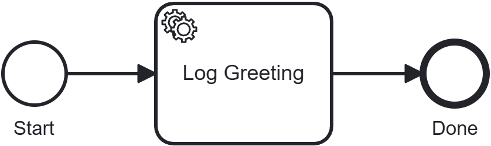

import Tabs from '@theme/Tabs';
import TabItem from '@theme/TabItem';

# First BPMN process

With the engine running from the [previous chapter](run-the-engine), you'll now put it to work — talking to it over its REST and gRPC APIs, exactly as your own code will. By the end you'll have deployed a process, written a worker that does real work, and watched an instance run to completion.

:::info New to BPM?
The engine executes business processes described as **BPMN** diagrams. A **process definition** is the blueprint; a running copy of it is a **process instance**; a **job** is the unit of work the engine creates when an instance reaches a task; a **worker** is a program *you* write that carries out a step by taking jobs. That's enough for this tutorial — for the full picture, see [BPM Concepts](../../explanation/bpm-concepts).

Coming from Camunda or Zeebe? This is the familiar external-worker model over gRPC; skim [the terminology mapping](../../explanation/bpm-concepts#terminology-mapping) and read straight on.
:::

## What you'll build {#what-youll-build}

You'll run a minimal process (`first-bpmn-process.bpmn`): a single service task, *Log Greeting*. When an instance reaches that task, the engine creates a **job** and waits. Nothing happens until a **worker** — which you'll write — connects, picks the job up, reads a variable, and prints a greeting.

{/* Rendered from getting-started/02-first-bpmn-process/first-bpmn-process.bpmn via bpmn-to-image.
    Keep the .bpmn source next to the SVG so the figure always matches the real process. */}


That "the engine creates a job and waits for your worker" mechanic is the heart of ZenBPM — this tutorial exists mainly to make it concrete.

## Prerequisites {#prerequisites}

- The **engine running locally** and the examples repo cloned — see [Run the engine](run-the-engine)
- `curl` — or any HTTP client
- For the worker (Step 3), **either** [Java](https://adoptium.net/) 17+ with [Maven](https://maven.apache.org/) **or** [Go](https://go.dev/dl/) 1.22+

## Step 1: Deploy a process {#step-1-deploy-a-process}

A **process definition** is a `.bpmn` file. This chapter's process is (`first-bpmn-process.bpmn`) in the repo you cloned. From `getting-started/`, move into the chapter folder:

```bash
cd 02-first-bpmn-process
```

Deploy it with a multipart upload:

```bash
curl -X POST http://localhost:8080/v1/process-definitions \
  -F "resource=@first-bpmn-process.bpmn"
```

The response contains a `processDefinitionKey` — a generated number that uniquely identifies this deployed definition. Note it; you'll start an instance from it next.

```json
{ "processDefinitionKey": 4503599627370498 }
```

The examples below use this exact key — it's what a freshly started engine with nothing else deployed returns for the first definition. If you've deployed anything else first, or you're picking this tutorial back up, use the key your own response actually returned instead.

## Step 2: Start an instance (and watch it wait) {#step-2-start-an-instance}

Starting an instance asks the engine to execute one copy of the definition. Use the key from Step 1:

```bash
curl -X POST http://localhost:8080/v1/process-instances \
  -H "Content-Type: application/json" \
  -d '{"processDefinitionKey": 4503599627370498, "variables": {}}'
```

You get back a `processInstanceKey` and a state of `active`:

```json
{
  "key": 4503599627370501,
  "processDefinitionKey": 4503599627370498,
  "state": "active"
}
```

Query the instance by its key:

```bash
curl http://localhost:8080/v1/process-instances/4503599627370501
```

It's **still active** — the token has reached the *Log Greeting* service task, the engine has created a job for it, and there it sits. The engine will never run your business logic itself; it's waiting for a worker to take the job. That's what you'll build now.

## Step 3: Write a worker {#step-3-write-a-worker}

A **worker** connects to the engine over gRPC, subscribes to a **job type**, and for each job: reads the variables, does the work, and reports completion. This process's service task creates jobs of type `log-worker`; the work is simply to print the `log` variable.

ZenBPM ships officially supported clients for Java and Go, and this chapter includes a ready-to-run worker project in each (the `java/` and `go/` folders of [`getting-started/02-first-bpmn-process`](https://github.com/pbinitiative/zenbpm-examples/tree/main/getting-started/02-first-bpmn-process)). Pick your language:

<Tabs groupId="worker-language">
<TabItem value="java" label="Java" default>

The Java client is a Spring Boot starter: you declare a worker as a bean method annotated with `@JobWorker`, and the starter connects to the engine on startup.

The client is on **Maven Central** under `org.pbinitiative.zenbpm`, versioned in step with the engine (`1.4.0`). Here is a complete, copy-pasteable `pom.xml`:

```xml
<?xml version="1.0" encoding="UTF-8"?>
<project xmlns="http://maven.apache.org/POM/4.0.0"
         xmlns:xsi="http://www.w3.org/2001/XMLSchema-instance"
         xsi:schemaLocation="http://maven.apache.org/POM/4.0.0 https://maven.apache.org/xsd/maven-4.0.0.xsd">
  <modelVersion>4.0.0</modelVersion>

  <parent>
    <groupId>org.springframework.boot</groupId>
    <artifactId>spring-boot-starter-parent</artifactId>
    <version>3.3.4</version>
    <relativePath/>
  </parent>

  <groupId>org.pbinitiative.examples</groupId>
  <artifactId>first-bpmn-process-worker</artifactId>
  <version>1.0.0</version>

  <properties>
    <java.version>17</java.version>
    <zenbpm.version>1.4.0</zenbpm.version>
    <opentelemetry.version>1.58.0</opentelemetry.version>
  </properties>

  <dependencyManagement>
    <dependencies>
      <!-- The ZenBPM starter needs a newer OpenTelemetry than Spring Boot 3.3.x manages. -->
      <dependency>
        <groupId>io.opentelemetry</groupId>
        <artifactId>opentelemetry-bom</artifactId>
        <version>${opentelemetry.version}</version>
        <type>pom</type>
        <scope>import</scope>
      </dependency>
    </dependencies>
  </dependencyManagement>

  <dependencies>
    <!-- Spring Boot core. The ZenBPM starter declares spring-boot-autoconfigure as optional (not transitive), so the application must provide Spring Boot itself. -->
    <dependency>
      <groupId>org.springframework.boot</groupId>
      <artifactId>spring-boot-starter</artifactId>
    </dependency>
    <!-- ZenBPM Spring Boot starter: provides @JobWorker and auto-connects on startup. -->
    <dependency>
      <groupId>org.pbinitiative.zenbpm</groupId>
      <artifactId>zenbpm-spring-boot-starter</artifactId>
      <version>${zenbpm.version}</version>
    </dependency>
    <!-- Required for gRPC job workers. -->
    <dependency>
      <groupId>io.grpc</groupId>
      <artifactId>grpc-netty-shaded</artifactId>
      <version>1.80.0</version>
    </dependency>
  </dependencies>

  <build>
    <plugins>
      <plugin>
        <groupId>org.springframework.boot</groupId>
        <artifactId>spring-boot-maven-plugin</artifactId>
      </plugin>
    </plugins>
  </build>
</project>
```

Point the starter at your engine in `application.yml`:

```yaml
zenbpm:
  grpcHost: localhost
  grpcPort: 9090
  grpcPlaintext: true
  jobWorkerEnabled: true
```

Declare the worker. The method subscribes to the `log-worker` job type, reads the `log` variable, and prints it:

```java
import org.springframework.stereotype.Component;
import org.pbinitiative.zenbpm.grpc.JobWorker;
import org.pbinitiative.zenbpm.grpc.JobContext;
import java.util.Map;

@Component
public class LogWorker {
  @JobWorker("log-worker")
  public Map<String, Object> handleJob(JobContext ctx) {
    System.out.println("[log-worker] " + ctx.getVariables().get("log"));
    return Map.of(); // no output variables; job complete
  }
}
```

This worker is ready in the chapter's `java/` folder. From `02-first-bpmn-process/`, start it:

```bash
cd java
mvn spring-boot:run
```

</TabItem>
<TabItem value="go" label="Go">

The Go client is part of the engine module (`github.com/pbinitiative/zenbpm/pkg/zenclient`). Register a worker with a handler function:

```go
package main

import (
	"context"
	"fmt"

	"github.com/pbinitiative/zenbpm/pkg/zenclient"
	"github.com/pbinitiative/zenbpm/pkg/zenclient/proto"
	"google.golang.org/grpc"
	"google.golang.org/grpc/credentials/insecure"
)

func main() {
	conn, err := grpc.NewClient(
		"127.0.0.1:9090",
		grpc.WithTransportCredentials(insecure.NewCredentials()),
	)
	if err != nil {
		panic(err)
	}
	defer conn.Close()

	zen := zenclient.NewGrpc(conn)

	// Subscribe to "log-worker" jobs.
	_, err = zen.RegisterWorker(context.Background(), "first-bpmn-process-worker",
		func(ctx context.Context, job *proto.WaitingJob) (map[string]any, *zenclient.WorkerError) {
			vars := job.GetVariables()
			fmt.Printf("[log-worker] %v\n", vars["log"])
			return map[string]any{}, nil // no output variables; job complete
		},
		"log-worker",
	)
	if err != nil {
		panic(err)
	}

	select {} // keep the worker running
}
```

This worker is ready in the chapter's `go/` folder. From `02-first-bpmn-process/`, start it:

```bash
cd go
go mod tidy
go run .
```

</TabItem>
</Tabs>

The worker connects, finds the waiting job from Step 2, and prints:

```
[log-worker] Hello, World!
```

The moment it reports the job complete, the engine advances the token past the service task to the end event.

:::note Client reference
Full dependency coordinates, configuration options, and REST/gRPC usage for both languages are in the [Client Libraries](../../static/client-libraries) reference.
:::

## Step 4: Observe completion {#step-4-observe-completion}

Query the same instance again:

```bash
curl http://localhost:8080/v1/process-instances/4503599627370501
```

Its state is now `completed`. You just watched the full engine loop: a token entered the process, waited at a service task, your worker did the work, and the instance finished — driven entirely through the API, exactly as your own application would drive it.

## Step 5: Make it yours {#step-5-make-it-yours}

Change the greeting and redeploy to see versioning in action. In `first-bpmn-process.bpmn`, find the input mapping that sets `log` to `Hello, World!` and change the text. Redeploy the same file:

```bash
curl -X POST http://localhost:8080/v1/process-definitions \
  -F "resource=@first-bpmn-process.bpmn"
```

Because the process id is unchanged, the engine stores this as a **new version** and returns a new `processDefinitionKey`. Start an instance against the new key (Step 2) with your worker still running — your new greeting prints. Older instances keep running on the version they started with.

## Clean up {#clean-up}

Stop the worker (Ctrl+C), then move back up to the `getting-started/` folder and stop the engine:

```bash
cd ../..
docker compose down
```

## Next steps {#next-steps}

- **Understand the model.** [BPM Concepts](../../explanation/bpm-concepts) — definitions, instances, tokens, and the job/worker mechanic in one short read.
- **Service tasks.** Look at the detailed [Service Task](../../reference/bpmn/supported-elements/activities/tasks/service-task) reference overview.
- **More workers.** [`examples/workers/`](https://github.com/pbinitiative/zenbpm-examples/tree/main/examples/workers) shows several workers in one Go project.
- **The APIs in full.** [REST (OpenAPI)](../../static/openapi) and the [gRPC proto](/zenbpm.proto).
- **Engine internals.** [Architecture](/category/architecture).
