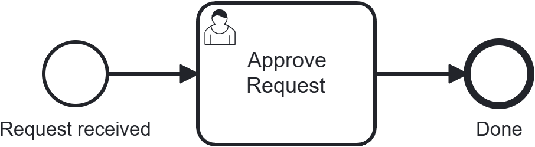

import Tabs from '@theme/Tabs';
import TabItem from '@theme/TabItem';

# Orchestrate human tasks

In the [previous chapter](first-bpmn-process), a *service task* handed work to a worker you wrote. Many processes also need a step that waits for a **person** — an approval, a review, a form to fill in. In BPMN that's a **user task**, and this chapter shows how to drive one with the engine.

The key difference: a service task is completed by a worker that *polls* the engine; a user task is completed by *your application* (or a person through the UI) calling the engine when the human is done. At the engine level both are **jobs**, and both are reachable through the REST `/jobs` API — but for a service task you'll typically use the gRPC worker SDK instead, since polling and retries are exactly what it's built for. This chapter drives a user-task job with plain REST calls, no worker needed.

:::info Prerequisites
The engine running locally and the examples repo cloned, as set up in [Run the engine](run-the-engine). No worker is needed this time — you'll play the human.
:::

## What you'll build {#what-youll-build}

A minimal **approval** process: a request comes in, a person approves or rejects it, done.

{/* Rendered from getting-started/03-orchestrate-human-tasks/approval-process.bpmn via bpmn-to-image.
    Keep the .bpmn source next to the PNG so the figure always matches the real process. */}


This chapter's process is `approval-process.bpmn`. From `getting-started/`, move into the chapter folder:

```bash
cd 03-orchestrate-human-tasks
```

In the BPMN, the human step is a plain `<bpmn:userTask>` element. Unlike a service task, ZenBPM needs no extension markup to recognize it: reaching any user task always creates a job of the fixed type `user-task-type` and waits — that's all `approval-process.bpmn` relies on here.

You can optionally route a user task to a specific person or group right in the model, with a native `<zenbpm:assignmentDefinition assignee="..." candidateGroups="..." />` extension element — see [User task](../../reference/bpmn/supported-elements/activities/tasks/user-task) for the full attribute reference. This tutorial assigns at runtime instead, over REST, in Step 3 below, which is why `approval-process.bpmn` carries no extension elements at all.

## Step 1: Deploy and start {#step-1-deploy-and-start}

Deploy the process and start an instance, exactly as in the previous tutorial:

```bash
# Deploy
curl -X POST http://localhost:8080/v1/process-definitions \
  -F "resource=@approval-process.bpmn"
# -> note the returned processDefinitionKey

# Start an instance
curl -X POST http://localhost:8080/v1/process-instances \
  -H "Content-Type: application/json" \
  -d '{"processDefinitionKey": <PROCESS_DEFINITION_KEY>, "variables": {}}'
# -> note the returned processInstanceKey
```

Query the instance — it's `active`, because the token has reached the user task and is waiting for a person:

```bash
curl http://localhost:8080/v1/process-instances/<PROCESS_INSTANCE_KEY>
```

## Step 2: Find the pending task {#step-2-find-the-task}

User tasks are jobs of the fixed type `user-task-type`. List the ones waiting to be worked on:

<Tabs groupId="client">
<TabItem value="curl" label="cURL" default>

```bash
curl "http://localhost:8080/v1/jobs?processInstanceKey=<PROCESS_INSTANCE_KEY>&jobType=user-task-type&state=active"
```

</TabItem>
<TabItem value="java" label="Java">

```java
// zenbpm: the injected ZenbpmClientService (see Client Libraries) that supplies the configured ApiClient.
// JobApi is generated from the OpenAPI spec; construct it with the ApiClient.
JobApi jobApi = new JobApi(zenbpm.getApiClient());
Long processInstanceKey = 0L; // set this to the processInstanceKey from Step 1
JobPartitionPage jobs = jobApi.getJobs(
    /* processInstanceKey */ processInstanceKey,
    /* jobType */ "user-task-type",
    /* assignee */ null,
    /* state */ "active",
    /* page */ 1,
    /* size */ 10,
    /* sortBy */ null,
    /* sortOrder */ null
);

// jobApi and jobKey are reused in the assign/complete examples below.
Long jobKey = jobs.getPartitions().get(0).getItems().get(0).getKey();
```

</TabItem>
<TabItem value="go" label="Go">

```go
ctx := context.Background()
restClient, _ := zenclient.NewClient("http://localhost:8080/v1")
processInstanceKey := int64(0) // set this to the processInstanceKey from Step 1
jobType := "user-task-type"
state := zenclient.JobStateActive
resp, _ := restClient.GetJobs(ctx, &zenclient.GetJobsParams{
    ProcessInstanceKey: &processInstanceKey,
    JobType:            &jobType,
    State:              &state,
})
defer resp.Body.Close()

// ctx, restClient, and jobKey are reused in the assign/complete examples below.
var jobs zenclient.JobPartitionPage
json.NewDecoder(resp.Body).Decode(&jobs)
jobKey := jobs.Partitions[0].Items[0].Key
```

</TabItem>
</Tabs>

The response lists each waiting task with its `key`, the `elementId` (`Activity_1dyxkwc` for this process's user task), the `processInstanceKey`, and its `inputVariables` — empty here, since the process was started with no variables and the task has no input mapping, but this is where you'd find whatever data a real process passed in for the person to act on. Note the job `key`; you'll use it next.

## Step 3: Assign the task {#step-3-assign-the-task}

Claiming a task records who is responsible for it. In a real app this happens when a user opens the task in their inbox.

<Tabs groupId="client">
<TabItem value="curl" label="cURL" default>

```bash
curl -X POST http://localhost:8080/v1/jobs/<JOB_KEY>/assign \
  -H "Content-Type: application/json" \
  -d '{"assignee": "john.doe"}'
```

</TabItem>
<TabItem value="java" label="Java">

```java
// Reuses jobApi and jobKey from Step 2.
// AssignJobRequest follows openapi-generator's default naming for this endpoint's request body;
// check your installed zenbpm-java-client version if it doesn't resolve.
jobApi.assignJob(jobKey, new AssignJobRequest().assignee("john.doe"));
```

</TabItem>
<TabItem value="go" label="Go">

```go
// Reuses restClient, ctx, and jobKey from Step 2.
restClient.AssignJob(ctx, jobKey, zenclient.AssignJobJSONRequestBody{
    Assignee: "john.doe",
})
```

</TabItem>
</Tabs>

A successful assign returns `204 No Content`.

## Step 4: Complete the task with a decision {#step-4-complete-the-task}

When the person is done, complete the job. The variables you send become part of the process instance — this is how the human's decision flows into the rest of the process (for example, a later gateway could branch on `approved`).

<Tabs groupId="client">
<TabItem value="curl" label="cURL" default>

```bash
curl -X POST http://localhost:8080/v1/jobs/<JOB_KEY>/complete \
  -H "Content-Type: application/json" \
  -d '{"variables": {"approved": true}}'
```

</TabItem>
<TabItem value="java" label="Java">

```java
// Reuses jobApi and jobKey from Step 2.
// CompleteJobRequest follows openapi-generator's default naming for this endpoint's request body;
// check your installed zenbpm-java-client version if it doesn't resolve.
jobApi.completeJob(jobKey, new CompleteJobRequest()
    .variables(Map.of("approved", true)));
```

</TabItem>
<TabItem value="go" label="Go">

```go
// Reuses restClient, ctx, and jobKey from Step 2.
restClient.CompleteJob(ctx, jobKey, zenclient.CompleteJobJSONRequestBody{
    Variables: &map[string]any{"approved": true},
})
```

</TabItem>
</Tabs>

The token advances to the end event. Query the instance again — it's now `completed`, and its variables include the `approved` decision you submitted:

```bash
curl http://localhost:8080/v1/process-instances/<PROCESS_INSTANCE_KEY>
```

## Where the form comes from {#where-the-form-comes-from}

ZenBPM doesn't dictate a form format at the engine level: a user-task job's `inputVariables` are just whatever the process passed in, and `completeJob` accepts whatever `variables` your app sends back. Rendering an actual form for the person is entirely up to your application.

The convention used across the ZenBPM ecosystem — including the ZenBPM UI and the [Contract Closing & Commission Settlement showcase](https://github.com/pbinitiative/zenbpm-examples/tree/main/showcases/contract-closing-commission-settlement) in this repo — is to carry a [bpmn-io form](https://bpmn.io/toolkit/form-js/) JSON schema in a job variable conventionally named `ZEN_FORM`. In that showcase, the backend keeps one schema file per task (`process/forms/<ElementId>.json`, e.g. `UT_ManagerApproval.json`) and injects it into the job's `inputVariables` under `ZEN_FORM` if the process itself doesn't already supply one; the frontend reads that same variable name to render the form.

`approval-process.bpmn` here doesn't attach a form — Step 4's `curl` stands in for "submit the form" — but this is the pattern you'd follow to build a real task inbox.

## Rejecting, and where your app fits {#rejecting-and-where-your-app-fits}

Completing with `{"approved": false}` is a perfectly normal outcome — "reject" is a decision, not an error, so you still **complete** the job (with a different variable) rather than failing it. Reserve `POST /jobs/{jobKey}/fail` for genuine failures (a downstream system was unreachable, invalid data), which mark the job as failed and create an incident — see [Jobs](../../reference/jobs) for the full failure and retry model.

In a real system you don't call these endpoints by hand. Your application backend:

1. lists user-task jobs (Step 2) to build each person's task inbox,
2. assigns a task when someone opens it (Step 3),
3. renders the task's form (see [above](#where-the-form-comes-from)), and on submit completes the task with the entered variables (Step 4).

The engine stays the source of truth for what's pending and what was decided; your app is just the human-facing surface — and the ZenBPM UI is one ready-made such surface.

## Next steps {#next-steps}

- **A realistic process.** The [Contract Closing & Commission Settlement showcase](https://github.com/pbinitiative/zenbpm-examples/tree/main/showcases/contract-closing-commission-settlement) combines several user tasks with a service task and an exclusive gateway (branching on a business-rule-task result), each user task backed by a real `ZEN_FORM`.
- **The concepts.** [BPM Concepts → tasks](../../explanation/bpm-concepts#tasks) explains user vs. service tasks and the job model.
- **The full API.** The `/jobs` endpoints in the [REST reference](../../static/openapi).
