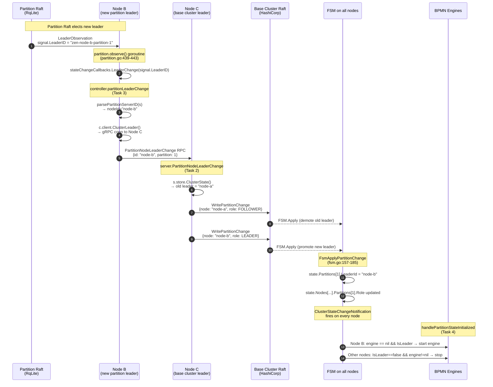
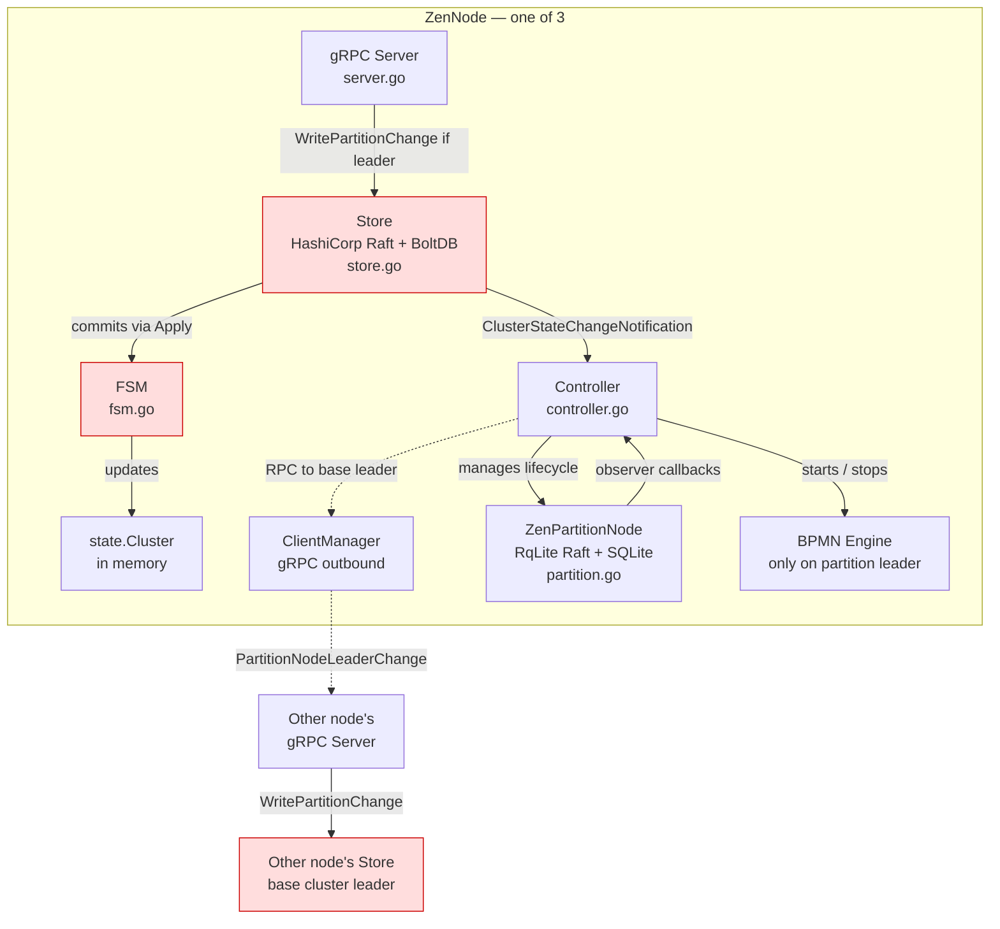

# Phase 1 — Orientation Reference

> Reference material from the Task 0 orientation walkthrough for
> Phase 1 (Partition Leader Propagation).
> Keep this handy while implementing Tasks 1–8.

---

## Big Picture

**Problem:** When a partition Raft group elects a new leader, nothing happens — the callback `partitionLeaderChange` panics, the base cluster state never updates, and engines don't start/stop on the right nodes. Partition failover is completely broken.

**Goal:** After Phase 1, killing a partition leader triggers: new leader election → base cluster state reflects it → BPMN engine starts on the new leader → engine stops on the old leader.

**Data flow you're building:**

```
Partition Raft elects new leader
  → partition observer fires LeaderChange callback
    with ServerID "zen-{nodeId}-partition-{partitionId}"
  → controller.partitionLeaderChange() parses the ServerID
  → controller sends PartitionNodeLeaderChange RPC to base cluster leader
  → server handler writes NodePartitionChange{role=LEADER} (new)
                   and  NodePartitionChange{role=FOLLOWER} (old)
                   via Raft
  → FSM applies both changes
    → state.Partitions[id].LeaderId updated on ALL nodes
  → ClusterStateChangeNotification fires on each node
  → handlePartitionStateInitialized:
      new leader starts engine, old leader stops engine
```

---

## Flow Diagram — Full End-to-End

This sequence shows a 3-node cluster where **Node A** is the base cluster leader and initially the partition-1 leader. Node A crashes, the partition Raft elects **Node B** as the new leader, and Node C (the new base cluster leader) propagates the change.



## Architecture — Who Talks to Whom



**Legend:**
- **Solid arrows** = in-process calls
- **Dotted arrows** = cross-node gRPC
- **Red boxes** = Raft-backed state — only the base cluster leader can accept writes

---

## Two-Level Raft Architecture

ZenBPM runs **two tiers of Raft consensus**:

1. **Base cluster (HashiCorp Raft)** — manages cluster membership, partition assignments, global state. The `Store` (`internal/cluster/store/store.go`) wraps this; its FSM (`fsm.go`) applies state changes.

2. **Partition groups (RqLite Raft)** — provide the actual data storage (SQLite via RqLite). Each `ZenPartitionNode` (`internal/cluster/partition/partition.go`) is one node in a partition's RqLite Raft group.

The two tiers elect leaders **independently**. The base cluster leader and a partition leader don't have to be the same node.

---

## FSM — Finite State Machine

In Raft, the FSM applies committed log entries to your application state.

**Flow:**
1. Someone calls `store.WritePartitionChange(change)` — submits a command to the Raft log.
2. Raft replicates the log entry to a quorum of nodes (consensus).
3. Once committed, **every node's FSM** receives the entry via `FSM.Apply(log)`.
4. The FSM deterministically mutates local state based on the log entry.

**Key property:** all nodes run the same FSM on the same log entries in the same order → all nodes converge to identical state. That's Raft's consistency guarantee.

**Why it must be deterministic:** if node A adds `"x"` and node B adds `"y"` from the same log entry, they diverge. FSM code must never use randomness, clocks, or external calls — only the log entry's data.

---

## Step 0.1 — Callback Wiring

**File:** `internal/cluster/controller/controller.go` lines 265–282

Inside `handlePartitionStateJoining`, the `PartitionChangesCallbacks` struct is populated when a partition node is started.

**Key facts:**

- **Line 263** — ServerID naming convention:
  ```go
  partitionConf.RqLite.NodeID = fmt.Sprintf("zen-%s-partition-%d", c.store.ID(), partitionId)
  ```
  So a ZenNode `"test-node-1"` participating in partition 5 uses partition-level ID `"zen-test-node-1-partition-5"`.

- **Line 272–273** — `LeaderChange` callback closure:
  ```go
  LeaderChange: func(s raft.ServerID) error {
      return c.partitionLeaderChange(s, partitionId)
  }
  ```
  The closure captures `partitionId`; the callback only receives a `raft.ServerID`.

- **Lines 266–280** — all 5 callbacks (`AddNewNode`, `ShutdownNode`, `LeaderChange`, `RemoveNode`, `ResumeNode`) are wired to controller methods that currently `panic("unimplemented")`.

---

## Step 0.3 — The Partition Observer

**File:** `internal/cluster/partition/partition.go`

### Callback struct — lines 80–91

```go
type PartitionChangesCallbacks struct {
    AddNewNode   func(raft.Server) error    // new node joined
    ShutdownNode func(raft.ServerID) error  // node removed
    LeaderChange func(raft.ServerID) error  // leader elected
    RemoveNode   func(id string) error      // reap
    ResumeNode   func(id string) error      // back online
}
```

### Observer goroutine — line 386 (`observe()`)

Listens to raft observations in a goroutine.

### The critical dispatch — lines 439–443

```go
case raft.LeaderObservation:
    if zpn.stateChangeCallbacks.LeaderChange == nil {
        break
    }
    _ = zpn.stateChangeCallbacks.LeaderChange(signal.LeaderID)
```

Notice:
- nil check guards against nil pointer panic.
- **Error return is discarded** (`_ =`).
- A **`panic`** inside the callback propagates up from the goroutine and crashes the entire process.
- `signal.LeaderID` is the partition-level server ID — format `"zen-{nodeId}-partition-{id}"`.

**This is why the current `panic("unimplemented")` is dangerous** — it crashes the node the moment any partition elects a leader.

---

## Step 0.4 — FSM Applies Partition Change

**File:** `internal/cluster/store/fsm.go` lines 157–185

```go
func FsmApplyPartitionChange(store FsmStore, partitionChangeCommand *proto.NodePartitionChange) state.Cluster {
    currState := store.ClusterState()
    node, ok := currState.Nodes[partitionChangeCommand.GetNodeId()]
    if !ok {
        node = state.Node{
            Id:         partitionChangeCommand.GetNodeId(),
            Partitions: make(map[uint32]state.NodePartition),
        }
    }
    if partitionChangeCommand.GetState() == proto.NodePartitionState_NODE_PARTITION_STATE_LEAVING {
        delete(node.Partitions, partitionChangeCommand.GetPartitionId())
        currState.Nodes[partitionChangeCommand.GetNodeId()] = node
        return currState
    }
    node.Partitions[partitionChangeCommand.GetPartitionId()] = state.NodePartition{
        Id:    partitionChangeCommand.GetPartitionId(),
        State: state.NodePartitionState(partitionChangeCommand.GetState()),
        Role:  state.Role(partitionChangeCommand.GetRole()),
    }
    if partitionChangeCommand.GetRole() == proto.Role_ROLE_TYPE_LEADER {
        currState.Partitions[partitionChangeCommand.GetPartitionId()] = state.Partition{
            Id:       partitionChangeCommand.GetPartitionId(),
            LeaderId: partitionChangeCommand.GetNodeId(),
        }
    }
    currState.Nodes[partitionChangeCommand.GetNodeId()] = node
    return currState
}
```

**Key behavior:**
- Auto-creates the node entry if missing (upsert).
- Special case: `LEAVING` state removes partition from node map.
- Normal case: updates `NodePartition.State` and `Role`.
- **When `Role == LEADER`**, overwrites `currState.Partitions[id]` with new `LeaderId`. ← This is what propagates partition leadership to cluster-level state.

**The gap you must fill in Task 2:** The FSM does NOT automatically demote the old leader. If you only write the new leader, the old leader's `NodePartition.Role` remains `LEADER` (stale). Task 2's server handler must write BOTH a demotion for the old leader AND a promotion for the new leader.

**Important:** You don't touch the FSM — it already does what you need. Your job is to write the right commands.

---

## Step 0.5 — `WritePartitionChange`

**File:** `internal/cluster/store/store.go` lines 176–192

```go
func (s *Store) WritePartitionChange(change *proto.NodePartitionChange) error {
    command := &proto.Command{
        Type: proto.Command_TYPE_NODE_PARTITION_CHANGE.Enum(),
        Request: &proto.Command_NodePartitionChange{
            NodePartitionChange: change,
        },
    }
    b, err := pb.Marshal(command)
    if err != nil {
        return fmt.Errorf("failed to marshal NodePartitionChange message before applying to log: %w", err)
    }
    f := s.raft.Apply(b, s.cfg.RaftTimeout)
    if f.Error() != nil && f.Response() != nil {
        return fmt.Errorf("failed to apply NodePartitionChange message to raft log: %w", f.Error())
    }
    return nil
}
```

**The 4-step Raft write pattern:**
1. Wrap the payload in a `Command` envelope with a type tag (FSM dispatches on it).
2. Serialize to protobuf bytes (Raft log entries are opaque bytes).
3. `s.raft.Apply(b, timeout)` submits to the Raft log — **only works on the leader**.
4. Check the returned future for errors.

**What happens under the hood after `Apply` returns:**
- Leader writes entry to its local log.
- Leader sends `AppendEntries` to all followers.
- Once a quorum acknowledges → **committed**.
- Every node invokes `FSM.Apply(log)` on the entry.
- FSM unmarshals → dispatches by type → calls `FsmApplyPartitionChange` → state mutated on all nodes.

**Phase 1 consequence:** `WritePartitionChange` can only be called on the base cluster leader. The `partitionLeaderChange` callback may run on a follower, so it must RPC to the leader via `c.client.ClusterLeader()` → `PartitionNodeLeaderChange` RPC → leader calls `WritePartitionChange` locally.

---

## Step 0.6 — Command Protobuf

**File:** `internal/cluster/command/proto/zencommand.proto`

### Command envelope — lines 6–18

```proto
message Command {
  enum Type {
    TYPE_UNKNOWN = 0;
    TYPE_NOOP = 1;
    TYPE_NODE_CHANGE = 2;
    TYPE_NODE_PARTITION_CHANGE = 3;
  }
  Type type = 1;
  oneof request {
    NodeChange node_change = 2;
    NodePartitionChange node_partition_change = 3;
  }
}
```

### Role enum — lines 20–24

```proto
enum Role {
  ROLE_TYPE_UNKNOWN = 0;
  ROLE_TYPE_FOLLOWER = 1;
  ROLE_TYPE_LEADER = 2;
}
```

### Partition state machine — lines 48–63

```
JOINING → INITIALIZING → INITIALIZED
                               ↘
                              LEAVING
```

```proto
enum NodePartitionState {
  NODE_PARTITION_STATE_UNKNOWN = 0;
  NODE_PARTITION_STATE_ERROR = 1;
  NODE_PARTITION_STATE_JOINING = 2;
  NODE_PARTITION_STATE_LEAVING = 3;
  NODE_PARTITION_STATE_INITIALIZING = 4;
  NODE_PARTITION_STATE_INITIALIZED = 5;
}
```

### The message you'll write — lines 65–70

```proto
message NodePartitionChange {
  string node_id = 1;       // who changed
  uint32 partition_id = 2;  // which partition
  NodePartitionState state = 3;
  Role role = 4;
}
```

**Examples you'll build in Task 2:**

- Promote new leader:
  `{node_id: "new-node", partition_id: 1, state: INITIALIZED, role: LEADER}`
- Demote old leader:
  `{node_id: "old-node", partition_id: 1, state: INITIALIZED, role: FOLLOWER}`

**DO NOT hand-edit `*.pb.go` files.** Proto changes require `make generate`. Phase 1 needs zero proto changes.

---

## Step 0.7 — gRPC Service RPC

**File:** `internal/cluster/proto/zen_cluster.proto`

### RPC definition — lines 24–26

```proto
// called by a partition leader when he becomes a leader of partition cluster
rpc PartitionNodeLeaderChange(PartitionNodeLeaderChangeRequest)
    returns (PartitionNodeLeaderChangeResponse);
```

### Request — lines 137–140

```proto
message PartitionNodeLeaderChangeRequest {
  string id = 1;        // the new leader node ID
  uint32 partition = 2; // which partition
}
```

Only **2 fields**. The server must look up the OLD leader itself (from `ClusterState().Partitions[id].LeaderId`) — the caller doesn't send it.

### Response — lines 142–144

```proto
message PartitionNodeLeaderChangeResponse {
  ErrorResult error = 1;
}
```

Errors come back as a response field, not a gRPC error. Follow this pattern in Task 2.

### The full RPC flow

```
Node A (partition leader elected)
  ↓ controller.partitionLeaderChange callback
  ↓ gRPC: PartitionNodeLeaderChange{id: "node-a", partition: 1}
Base cluster leader's Server
  ↓ server.PartitionNodeLeaderChange handler
  ↓ look up old leader from state
  ↓ WritePartitionChange for old leader (FOLLOWER)
  ↓ WritePartitionChange for new leader (LEADER)
  ↓ Raft replicates both to all nodes
  ↓ FSM applies on every node
All nodes see updated state.Partitions[1].LeaderId = "node-a"
  ↓ ClusterStateChangeNotification fires on every node
  ↓ controller.handlePartitionStateInitialized
New leader starts engine, old leader stops engine
```

---

## Step 0.8 — Test Pattern (`ControllerTestStore`)

**File:** `internal/cluster/controller/controller_test.go` lines 110–204

### The struct — lines 110–115

```go
type ControllerTestStore struct {
    id           string
    addr         string
    clusterState state.Cluster
    leader       bool
}
```

### Implements four interfaces at once

- `controller.ControlledStore` (controller calls into it)
- `client.ClientStore` (gRPC client manager routes with it)
- `store.FsmStore` (reads from it)
- `server.StoreService` (gRPC server calls into it)

### The magic method — lines 178–181

```go
func (c *ControllerTestStore) WritePartitionChange(change *proto.NodePartitionChange) error {
    c.clusterState = store.FsmApplyPartitionChange(c, change)
    return nil
}
```

Instead of real Raft consensus, **applies the FSM function synchronously** → fast, deterministic unit tests.

### Self-leader — lines 138–145

```go
func (c *ControllerTestStore) LeaderWithID() (string, string) {
    return c.addr, c.id
}
func (c *ControllerTestStore) PartitionLeaderWithID(partition uint32) (string, string) {
    return c.addr, c.id
}
```

The store pretends to be its own leader → gRPC client manager routes RPCs to the local server.

### Async poll helper — lines 183–204

```go
testPoll(t, func() bool { ... }, 100*time.Millisecond, 5*time.Second, "message")
```

Use when a state change propagates through goroutines (e.g. after `ClusterStateChangeNotification`).

### Test assembly pattern (Task 3 will use this)

1. Create `ControllerTestStore` with pre-populated state.
2. Start a real in-process gRPC server bound to the store.
3. Start a controller with a client manager pointing at the store.
4. Call `controller.partitionLeaderChange(raft.ServerID("zen-node-2-partition-1"), 1)`.
5. Callback does `c.client.ClusterLeader()` → local gRPC server → RPC handler → `tStore.WritePartitionChange` → FSM mutates `tStore.clusterState` synchronously.
6. Assert `tStore.clusterState.Partitions[1].LeaderId == "node-2"`.

Full RPC round-trip, in-process, ~milliseconds — but exercises the real code path.

---

## Step 0.9 — Server Pattern

**File:** `internal/cluster/server/server.go`

### Server struct — lines 44–53

```go
type Server struct {
    proto.UnimplementedZenServiceServer
    ln         net.Listener
    addr       net.Addr
    store      StoreService   // ← what you'll call
    controller ControllerService
    jobManager *jobmanager.JobManager
    client     *client.ClientManager
    cpuProfile CpuProfile
}
```

### StoreService interface — lines 60–66

```go
type StoreService interface {
    Notify(nr *proto.NotifyRequest) error
    Join(jr *proto.JoinRequest) error
    WriteNodeChange(change *protoc.NodeChange) error
    ClusterState() state.Cluster                            // ← Task 2 reads this
    WritePartitionChange(change *protoc.NodePartitionChange) error  // ← Task 2 calls this
}
```

Everything Task 2 needs is already on this interface.

### Reference RPC — lines 133–167 (`NodeCommand`)

```go
func (s *Server) NodeCommand(ctx context.Context, req *protoc.Command) (*proto.NodeCommandResponse, error) {
    if ctx.Err() != nil {
        return nil, ctx.Err()
    }
    switch req.GetType() {
    case protoc.Command_TYPE_NODE_CHANGE:
        err := s.store.WriteNodeChange(req.GetNodeChange())
        if err != nil {
            return nil, fmt.Errorf("failed to write node change to store: %w", err)
        }
        return &proto.NodeCommandResponse{
            Type: protoc.Command_TYPE_NODE_CHANGE.Enum(),
            Response: &proto.NodeCommandResponse_NodeChange{
                NodeChange: &proto.ClusterNodeChangeResponse{},
            },
        }, nil
    case protoc.Command_TYPE_NODE_PARTITION_CHANGE:
        err := s.store.WritePartitionChange(req.GetNodePartitionChange())
        if err != nil {
            return nil, fmt.Errorf("failed to write node change to store: %w", err)
        }
        // ... return response
    // ...
    }
}
```

**The pattern to follow in Task 2:**
1. Check `ctx.Err()` (boilerplate).
2. Call `s.store.ClusterState()` to read state.
3. Call `s.store.WritePartitionChange(...)` to write.
4. Return a populated response struct.
5. On error, return `nil, fmt.Errorf(...)` (or populate `response.Error` for soft errors — both patterns exist; check the existing RPCs for style).

---

## Key Takeaways for Implementation

- **FSM is done.** Already handles `Role=LEADER` correctly.
- **Proto is done.** Zero changes for Phase 1.
- **Write path is done.** `WritePartitionChange` handles Raft replication.
- **Test harness is done.** `ControllerTestStore` gives you an in-process, synchronous FSM.

**Your actual Phase 1 work:**
1. Parse `"zen-{nodeId}-partition-{id}"` → `nodeId`, `partitionId` (Task 1).
2. Server RPC: demote old leader, promote new leader via `WritePartitionChange` (Task 2).
3. Controller callback: RPC to base cluster leader with the new leader's info (Task 3).
4. Start engine when this node becomes partition leader; stop when it loses (Task 4).
5. Handle engine create/start failures gracefully (Task 5).
6. Replace all remaining reachable `panic("unimplemented")` stubs with minimal no-op logging (Task 6).
7. Integration + E2E verification (Tasks 7–8).

---

## File Cheat Sheet

| File | Touch in | Purpose |
|------|----------|---------|
| `internal/cluster/controller/controller.go` | 1, 3, 4, 5, 6 | Partition callbacks, engine lifecycle, ID parsing |
| `internal/cluster/controller/controller_test.go` | 1, 3, 4, 6 | Unit tests |
| `internal/cluster/server/server.go` | 2, 6 | `PartitionNodeLeaderChange` RPC + other panic stubs |
| `internal/cluster/server/server_test.go` (new or extend) | 2 | RPC unit tests |
| `internal/cluster/store/fsm.go` | Read only | Understand `FsmApplyPartitionChange` |
| `internal/cluster/store/store.go` | Read only | Understand `WritePartitionChange` |
| `internal/cluster/partition/partition.go` | Read only | Understand observer callback flow |
| `internal/cluster/command/proto/zencommand.proto` | Read only | Command/Role/State enums |
| `internal/cluster/proto/zen_cluster.proto` | Read only | RPC definitions |

---

## Panic Inventory (3-node, 1-partition scenario)

All of these must be resolved (fully or with minimal no-op stubs) by end of Phase 1:

| Location | Fix task |
|----------|---------|
| `controller.go` — `partitionLeaderChange` | Task 3 (real impl) |
| `controller.go` — `partitionAddNewNode` | Task 6 (no-op log) |
| `controller.go` — `partitionShutdownNode` | Task 6 (no-op log) |
| `controller.go` — `partitionRemoveNode` | Task 6 (no-op log) |
| `controller.go` — `partitionResumeNode` | Task 6 (no-op log) |
| `server.go` — `PartitionNodeLeaderChange` | Task 2 (real impl) |
| `server.go` — `AddPartitionNode` | Task 6 (no-op) |
| `server.go` — `RemovePartitionNode` | Task 6 (no-op) |
| `server.go` — `ResumePartitionNode` | Task 6 (no-op) |
| `server.go` — `ShutdownPartitionNode` | Task 6 (no-op) |
