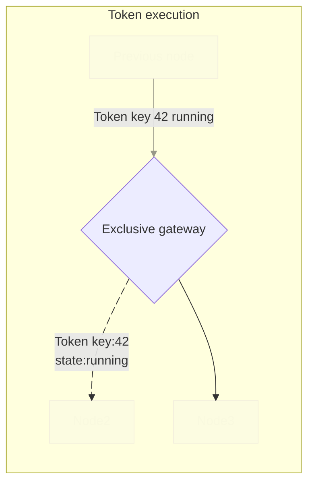
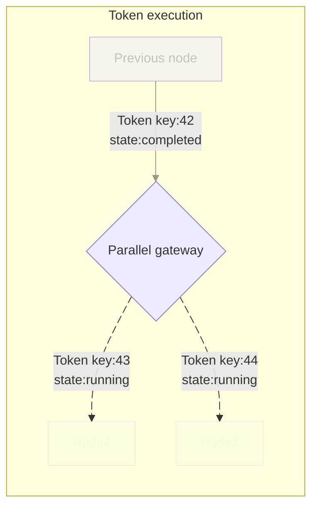

# BPMN engine

BPMN engine tries to adhere to the [bpmn 2 specification](https://www.omg.org/spec/BPMN/2.0.2/PDF) and be compatible with [Camunda 8](https://docs.camunda.io/).
The engine can be used through the ZenBPM platform or as a [standalone library](https://pkg.go.dev/github.com/pbinitiative/zenbpm/pkg/bpmn).

The engine is fully instrumented via [OpenTelemetry](https://opentelemetry.io/):
- Tracing: Each process, token, and flow node has spans.
- Metrics: Tracks counts of started, ended processes, worker executions etc.

## Storage
The engine uses a storage interface to interact with storage systems. ZenBPM platform implements a solution based on RqLite database. The codebase also provides a default implementation for in [memory storage](https://pkg.go.dev/github.com/pbinitiative/zenbpm/pkg/storage/inmemory) that is used by the engine's Unit tests.

## Node processing in the engine
Internally the engine uses "Tokens" as a pointers that traverse the diagram and represent execution state.
Tokens are manipulated based on node logic (e.g., split for gateways, wait for messages/timers).
One loop through the engine's main loop means processing the token's flow node and outgoing sequence flows.

### Execution Tokens
Tokens (ExecutionToken) track progress through flow nodes:
 - `Key`: Unique identifier.
 - `ElementId`: ID of the current BPMN element.
 - `State`: Running, Waiting, Completed, Failed.

### Exclusive Gateway example
The following example shows processing of an Exclusive Gateway.

Since Exclusive Gateway cannot create parallel flows the token gets reused and continues to flow through the diagram.

### Parallel Gateway example
The following example shows processing of a Parallel Gateway.

To keep track of the parallel executions the token that activated the gateway is completed and outgoing parallel flows get assigned a new tokens that each represents a parallel execution flow.

## Interacting with the BPMN engine

## Workers

## Supported elements
TODO: we should split these into separate pages with examples.

### Start event
Start event is fully supported.
### End event
End event is fully supported.
### Service task
Fully supported through external workers.
### User task
Fully supported through external workers.
### Business rule task
:::note[Future plans]
Supported through internal [dmn engine](/reference/dmn-engine).
:::
### Call activity
The subprocess for call activity is started on the same partition as the process that invoked it.
### Parallel gateway
Current implementation handles parallel flows correctly if there is only one overlapping flow in the process instance. **Multiple recursive parallel flows have currently undefined behaviour.**
### Inclusive gateway
Inclusive gateway is fully supported.
### Exclusive gateway
Exclusive gateway is fully supported.
### Event based gateway
Event based gateway currently supports message and timer events.
### Message catch event
Message catch event is fully supported.
### Link intermediate throw event
Link intermediate throw event is fully supported.
### Link intermediate catch event
Link intermediate catch event is fully supported.
### Timer intermediate catch event
Tiemr intermediate catch event is fully supported.
:::note[Future plans]
### Message throw event
### Error event
### Boundary event
### Activity multi instance
### Script task
:::

## XML parser
TODO: add information about how we are parsing xml definitions of processes
