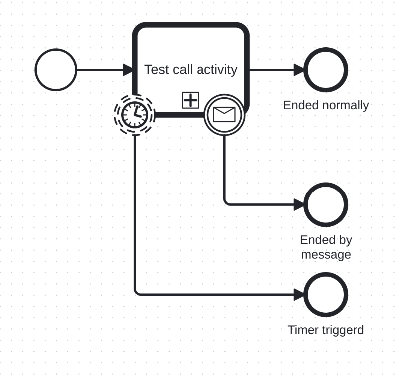

# Boundary event

A Boundary Event is a BPMN event that is attached to the boundary of an activity. It reacts to a specific trigger while the activity is in progress and changes the normal flow of execution.
 
Boundary event subscriptions are created by the engine when the token reaches the waiting state of the attached activity.

Both **interrupting** and **non-interrupting** boundary events are supported.

## Key characteristics
- **Attached to an activity:**  
  A Boundary Event is visually and logically attached to the boundary of an activity. It can only be triggered while the activity is active.

- **Triggered during activity execution:**   
The event is triggered by its defined event while the attached activity is active.

- **Interrupting vs. non-interrupting behavior:**
  - **Interrupting Boundary Event:**  
    When triggered, it interrupts and cancels the execution of the attached activity. The outgoing flow of the boundary event is taken, and the activity does not complete normally.
  - **Non-interrupting Boundary Event:**  
    When triggered, it does not cancel the attached activity. The original activity continues execution in parallel with the boundary event’s outgoing flow.

- **Single outgoing sequence flow:**  
  A Boundary Event may have one outgoing sequence flow that defines the alternative path taken when the event is triggered.

- **Subscription lifecycle:**  
  Event subscriptions are created when the token enters the waiting state of the attached activity and are removed when the activity completes or is interrupted.

  ## Supported activity types

Boundary Events can be attached to the following activity types:

- ServiceTask
- SendTask
- UserTask
- BusinessRuleTask
- CallActivity

## Execution behavior

- If the Boundary Event is **interrupting**, the attached activity is canceled immediately upon event trigger.
- If the Boundary Event is **non-interrupting**, the activity continues execution and an additional token is created for the boundary event’s outgoing flow.
- Boundary Events do not trigger if the activity has already completed.

## Current Implementation
Currently supported event types with boundary events:

- Message,
- Timer

_Boundary event usage example_