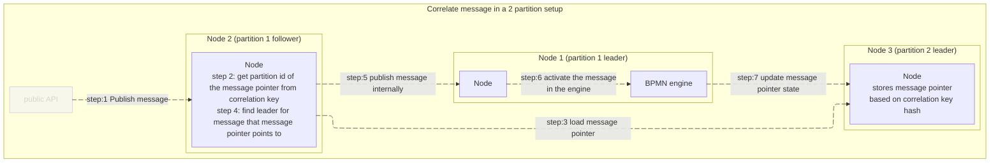

# Message Catch Event
A Message Catch Event is used to model the recipient of a message from an external participant or process.

## Key characteristics

- **Catching behavior:**  
  A Message Catch Event waits for an incoming message that matches its message definition.

- **Pauses process execution:**  
  When reached, the process execution is suspended until the message is received.

- **Incoming and outgoing sequence flows:**  
  A Message Catch Event must have at least one incoming sequence flow and typically has one outgoing sequence flow.

- **Message correlation:**  
  The received message is correlated to the correct process instance based on the message definition and correlation data.

- **Subscription lifecycle:**  
  At runtime, the engine creates a message subscription when the token reaches the Message Catch Event. The subscription is removed after the message is received and the process continues.

It indicates that the execution flow will pause until the specified message is received.
**ZenBPM implementation** of the engine tries to provide guarantees that only one message is active in the system with the same name and correlation key.

**Uniqueness**
Message Catch Event is identified by a **Correlation Key** and **Correlation Name**.
Combination of the two parameters is unique for each message catch event.
Running into Message Catch Event with an already existing combination results in Incident(link).

#### Message subscription

Message subscription is what we refer to when the engine stores data about the Message Catch Event.

#### Message subscription pointer

Message subscription pointers are used to correlate messages in Zen's architecture of a [distributed system](/reference/cluster).
Pointers are used to efficiently determine location of a stored subscription, without requiring any internal identifiers.
Pointer's storage partition is calculated from user defined **Correlation Key**.
From which we can determine partition assigned to **Message Subscription** and its **Process Instance** to then correlate the message.

## Supported message catch event types

The following Message Catch Event types are supported:

- **Intermediate Message Catch Event:**  
  Waits for a message during process execution and continues the flow when the message is received.

- **Message Boundary Event:**  
  Catches a message while the attached activity is active and reacts according to interrupting or non-interrupting behavior.

- **Message Start Event:**  
  Starts a new process instance when a message is received.

## Graphic Notation

A double-lined circle containing a message (envelope) icon.

## Usage

Messages can be published through API or by triggering [Intermediate throw event](/reference/bpmn/supported-elements/message-throw-event).
<!-- <ApiOperation id="api" pointer="#/paths/~1messages/post" example={true} />-->

Future plans:
We plan to implement message start event along with timer start events in the future.