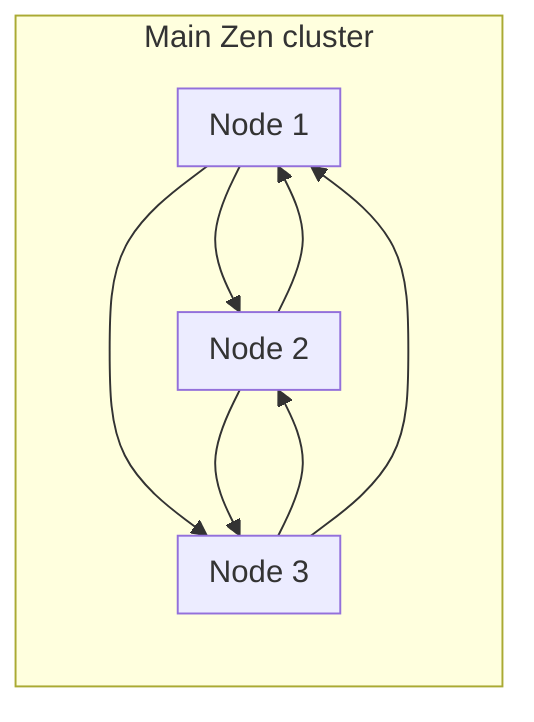

import ApiOperation from "@theme/ApiOperation";
import ApiSchema from "@theme/ApiSchema";

# Cluster

ZenBPM uses raft as its consensus algorithm. Zen cluster consists of:

- Main raft cluster serves the purpose of keeping track of the state of the cluster across multiple instances of the application.
- RqLite cluster groups provide storage layer for the application.

## Main cluster


```mermaid
flowchart LR

subgraph s1["Main Zen cluster"]
  subgraph Node3["Node 3"]
    end
  subgraph Node2["Node 2"]
    end
  subgraph Node1["Node 1"]
    end
end
Node1 --> Node2 & Node3
Node3 --> Node2 & Node1
Node2 --> Node3 & Node1
```

Instances of the application are connected through the internal GRPC api and when an event that concerns cluster state happens leader node is notified and updates the state of the cluster through raft.
The state of the cluster can be queried through the system API:

- REST: `/system/status`
- GRPC: TODO: add grpc endpoint as well

The REST response includes build metadata:

```json
{
  "git": {
    "branch": "main",
    "commitId": "0123456789ab"
  },
  "build": {
    "version": "v1.5.0",
    "time": "2026-08-07T12:13:14Z"
  },
  "clusterConfig": {},
  "partitions": {},
  "nodes": {}
}
```

The application version is stored in the repository's root `VERSION` file. During
the build, it is compared without the `v` prefix against `openapi/api.yaml`
`info.version`. Release, Makefile, and local Docker builds inject the source
commit, branch, and build time into the binary.

## Partition clusters

Partition clusters are smaller [RqLite](https://rqlite.io/) clusters created for data storage of each partition.

:::warning
Current theoretical limit for partitions is 122 due to network multiplexer implementation.
:::

:::note[Future plans]
You can specify how many partitions and partition replicas will be created through the [application configuration](/reference/configuration). After the cluster has been created you can modify these through [zenctl](/reference/zenctl) cli that is used to manage Zen clusters.
:::

:::note[Future plans]
You can query each partition database through the `zenctl` or public REST/GRPC API
:::
## Backup & Restore

ZenBPM provides a whole-cluster backup and restore API. A backup captures a point-in-time snapshot of every partition database and streams it as a single tar archive directly to the HTTP client — no external storage is required.

### Endpoint namespace convention

Backup and restore live under `/system/v1/...`, not the business API prefix. The convention: `/v1/**` is the business API and is fully documented in `openapi/api.yaml`; `/system` is the operational plane. Directly under `/system` sit the unversioned probes (`/system/status`, `/system/metrics`) that Kubernetes probes and Prometheus scrapers rely on staying stable; operational APIs that carry payload contracts (like the backup bundle format and the restore report) are versioned under `/system/v1/...` so they can evolve without breaking probes or clients.

The operational endpoints are described in [`openapi/system.yaml`](../../openapi/system.yaml) (documentation spec — the handlers are hand-registered in `internal/rest/server.go`, no server code is generated from it).

### What is backed up

- All partition SQLite databases (one gzipped snapshot per partition, taken concurrently from partition leaders).
- A `manifest.json` entry (last in the archive) containing: format version, ZenBPM binary version, partition count, and per-partition snapshot timestamp, stored size, sha256 checksum, and schema version.

**Not backed up:** cluster topology (raft membership, node addresses). Topology is environment-specific; only the partition count matters for a restore and is carried in the manifest.

### Taking a backup

`GET /system/v1/cluster/backup` may be called on **any** cluster node. The responding node coordinates the backup by pulling snapshots from each partition leader and streaming them directly to the HTTP response.

```bash
curl -o zenbpm-backup.tar http://<any-node>:<port>/system/v1/cluster/backup
```

The backup is non-blocking — the cluster continues to serve traffic during the download. Partition snapshots start concurrently, so there is a small (seconds) skew between them; this skew is repaired automatically by the reconciliation step during a restore.

If the connection drops before the archive is complete, the client receives a truncated tar with no manifest entry. A restore always rejects such a file. Simply retry the download.

### Performing a restore

`POST /system/v1/cluster/restore` **must be sent to the cluster raft leader** (v1 limitation — the maintenance gate is written through raft and only the leader can commit that change). Use `/system/status` to identify the current leader:

```bash
# Find the leader: look for the node whose "role" is "RoleLeader"
curl -s http://<any-node>:<port>/system/status | jq '.nodes | to_entries[] | select(.value.role == "RoleLeader") | .value.addr'
```

:::note
The `addr` field returned above is the node's internal cluster (raft) address, not its HTTP API endpoint. You must map the leader node to its HTTP base URL from your deployment configuration (e.g., the pod/service address) before issuing the restore request.
:::

#### Restore on an empty cluster

When the cluster has no deployed definitions and no running instances, a restore is accepted without any extra flags:

```bash
curl -X POST \
  --data-binary @zenbpm-backup.tar \
  http://<leader-node>:<port>/system/v1/cluster/restore
```

#### Restore on a live cluster (force)

To restore over an existing cluster that already holds definitions or instances, pass `?force=true`. This overwrites all partition data and should be treated as a destructive operation.

```bash
curl -X POST \
  --data-binary @zenbpm-backup.tar \
  "http://<leader-node>:<port>/system/v1/cluster/restore?force=true"
```

If the cluster is non-empty and `force=true` is omitted, the request is refused with `409 Conflict` and error code `RESTORE_FAILED`.

#### Partition count requirement

A backup can only be restored into a cluster configured with the **same number of partitions** as the one that produced the backup. The manifest carries the partition count; the restore validates it before making any changes. Mismatched counts are rejected immediately.

### What happens during a restore

1. **Validation** — manifest present, partition count matches, sha256 checksums pass, backup schema version is not newer than the running binary, and every partition file is a valid SQLite image. All checks run before any data is modified.
2. **Maintenance gate** — a raft-replicated `Restoring` flag is set. While this flag is active:
   - Mutating API calls (deploy, start instance, publish message, etc.) are rejected with an error indicating the cluster is in restore.
   - Read-only endpoints remain available but may see mixed state during the operation.
   - Partition engines and the job manager are paused.
3. **Partition loads** — partitions are loaded sequentially. Each partition image is sent to the partition leader, which applies it as a single raft entry and replicates it to followers.
4. **Migration re-run** — schema migrations are re-applied so that a backup taken from an older binary version is upgraded in place.
5. **Reconciliation** — definitions are synced across partitions, then message-subscription pointer tables are wiped and rebuilt from the authoritative subscription rows. See the [Restore report](#restore-report) section for details.
6. **Gate cleared** — the `Restoring` flag is removed, partition engines restart, and the response body with the restore report is returned.

### Restore report

On success the response is a JSON object:

```json
{
  "startedAtMillis": 1751724000000,
  "finishedAtMillis": 1751724005123,
  "partitions": [
    { "partitionId": 1, "loadMillis": 820 },
    { "partitionId": 2, "loadMillis": 910 }
  ],
  "pointersRebuilt": 42,
  "pointerConflicts": [
    {
      "name": "payment-received",
      "correlationKey": "order-99",
      "winnerKey": 7208432,
      "loserKeys": [7208100]
    }
  ],
  "definitionsSynced": [
    { "key": 4503599627370497, "type": "process", "toPartitions": [2] }
  ]
}
```

| Field | Description |
|-------|-------------|
| `partitions` | Per-partition load duration in milliseconds. |
| `pointersRebuilt` | Total number of message-subscription pointer rows written during reconciliation. |
| `pointerConflicts` | Pairs of duplicate active subscriptions sharing the same `(name, correlationKey)` caused by snapshot skew. The `winnerKey` subscription retained its pointer; `loserKeys` subscriptions did not. Each loser represents a potentially waiting process instance — review and cancel it if it should no longer proceed. |
| `definitionsSynced` | Process or DMN definitions that were missing from one or more partitions and were copied there during reconciliation. |

### Failure mid-restore

If a restore fails after the maintenance gate is set, the cluster remains in `Restoring` state. The operation is idempotent: submit the same backup tar again to retry from the beginning. There is no automatic rollback of a partially applied restore.

If the node running the restore crashes, the `Restoring` flag remains set in the raft cluster state. After electing a new leader, re-submit the restore to that node to complete the operation.

### Worker job key behaviour after restore

Workers that acquired job keys before the restore will receive `404 Not Found` when they attempt to complete or fail those jobs. This is expected — the partition data has been rolled back and those keys no longer exist. Workers should treat this as a signal to stop processing the job; no retry is needed.

### Scheduling backups

ZenBPM does not include a built-in scheduler. Use cron and curl:

```bash
# /etc/cron.d/zenbpm-backup
0 2 * * * root curl -sf -o /backups/zenbpm-$(date +\%Y\%m\%d).tar http://<any-node>:<port>/system/v1/cluster/backup
```

### Per-partition auto-backup (S3 / MinIO)

ZenBPM inherits rqlite's per-partition auto-backup capability (`AutoBackupFile` configuration). Each partition can push its snapshot independently to an S3-compatible store on a configurable interval. These per-partition snapshots have interval-sized skew between them.

To restore from per-partition S3 snapshots, download all partition files, assemble them with a valid `manifest.json` into a tar archive that matches the bundle layout, and submit the archive via `POST /system/v1/cluster/restore`. The same reconciliation (pointer rebuild, definition sync) runs as for any other restore, repairing the inter-partition skew.
