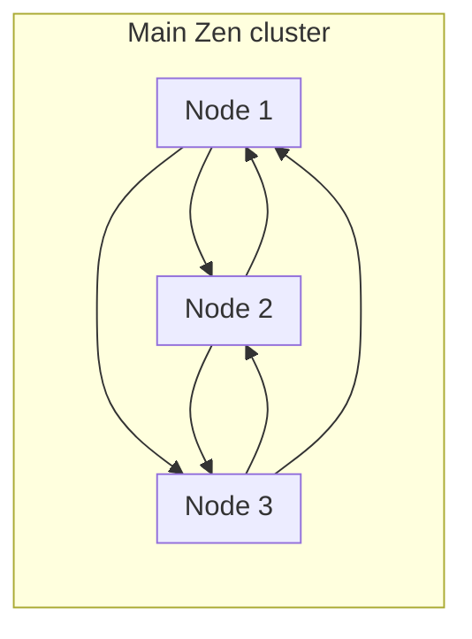

import ApiOperation from "@theme/ApiOperation";
import ApiSchema from "@theme/ApiSchema";

# Cluster

ZenBPM uses raft as its consensus algorithm. Zen cluster consists of:

- Main raft cluster serves the purpose of keeping track of the state of the cluster across multiple instances of the application.
- RqLite cluster groups provide storage layer for the application.

## Main cluster


```mermaid
flowchart LR

subgraph s1["Main Zen cluster"]
  subgraph Node3["Node 3"]
    end
  subgraph Node2["Node 2"]
    end
  subgraph Node1["Node 1"]
    end
end
Node1 --> Node2 & Node3
Node3 --> Node2 & Node1
Node2 --> Node3 & Node1
```

Instances of the application are connected through the internal GRPC api and when an event that concerns cluster state happens leader node is notified and updates the state of the cluster through raft.
The state of the cluster can be queried through the system API:

- REST: `/system/status`
- GRPC: TODO: add grpc endpoint as well

The REST response includes build metadata:

```json
{
  "git": {
    "branch": "main",
    "commitId": "0123456789ab"
  },
  "build": {
    "version": "v1.5.0",
    "time": "2026-08-07T12:13:14Z"
  },
  "clusterConfig": {},
  "partitions": {},
  "nodes": {}
}
```

The application version is stored in the repository's root `VERSION` file. During
the build, it is compared without the `v` prefix against `openapi/api.yaml`
`info.version`. Release, Makefile, and local Docker builds inject the source
commit, branch, and build time into the binary.

## Partition clusters

Partition clusters are smaller [RqLite](https://rqlite.io/) clusters created for data storage of each partition.

:::warning
Current theoretical limit for partitions is 122 due to network multiplexer implementation.
:::

:::note[Future plans]
You can specify how many partitions and partition replicas will be created through the [application configuration](./configuration.md). After the cluster has been created you can modify these through [zenctl](./zenctl.md) cli that is used to manage Zen clusters.
:::

:::note[Future plans]
You can query each partition database through the `zenctl` or public REST/GRPC API
:::
## Backup & Restore

ZenBPM provides a whole-cluster backup and restore API. A backup captures a point-in-time snapshot of every partition database and streams it as a single tar archive directly to the HTTP client — no external storage is required.

### Endpoint namespace convention

Backup and restore live under `/system/v1/...`, not the business API prefix. The convention: `/v1/**` is the business API and is fully documented in `openapi/api.yaml`; `/system` is the operational plane. Directly under `/system` sit the unversioned probes (`/system/status`, `/system/metrics`) that Kubernetes probes and Prometheus scrapers rely on staying stable; operational APIs that carry payload contracts (like the backup bundle format and the restore report) are versioned under `/system/v1/...` so they can evolve without breaking probes or clients.

The operational endpoints are described in [`openapi/system.yaml`](https://github.com/pbinitiative/zenbpm/blob/main/openapi/system.yaml) (documentation spec — the handlers are hand-registered in `internal/rest/server.go`, no server code is generated from it).

### What is backed up

- All partition SQLite databases (one gzipped snapshot per partition, taken concurrently from partition leaders).
- A `manifest.json` entry (last in the archive) containing: format version, ZenBPM binary version, partition count, and per-partition snapshot timestamp, stored size, sha256 checksum, and schema version.

**Not backed up:** cluster topology (raft membership, node addresses). Topology is environment-specific; only the partition count matters for a restore and is carried in the manifest.

### Taking a backup

`GET /system/v1/cluster/backup` may be called on **any** cluster node. The responding node coordinates the backup by pulling snapshots from each partition leader and streaming them directly to the HTTP response.

```bash
curl -o zenbpm-backup.tar http://<any-node>:<port>/system/v1/cluster/backup
```

The backup is non-blocking — the cluster continues to serve traffic during the download. Partition snapshots start concurrently, so there is a small (seconds) skew between them; this skew is repaired automatically by the reconciliation step during a restore.

If the connection drops before the archive is complete, the client receives a truncated tar with no manifest entry. A restore always rejects such a file. Simply retry the download.

### Performing a restore

`POST /system/v1/cluster/restore` **must be sent to the cluster raft leader** (the restore operation state is written through raft and only the leader can commit it). Use `/system/status` to identify the current leader:

```bash
# Find the leader: look for the node whose "role" is "RoleLeader"
curl -s http://<any-node>:<port>/system/status | jq '.nodes | to_entries[] | select(.value.role == "RoleLeader") | .value.addr'
```

:::note
The `addr` field returned above is the node's internal cluster (raft) address, not its HTTP API endpoint. You must map the leader node to its HTTP base URL from your deployment configuration (e.g., the pod/service address) before issuing the restore request.
:::

The request is synchronous: it returns when the restore reached a terminal state. After a successful restore the partition engines are serving again; a restore that failed after acquiring the cluster leaves the cluster gated until it is retried or aborted (see below). Closing the connection cancels the restore. Once the restore has acquired the cluster, the operation record (see below) stays durable and is marked `FAILED`; a cancellation while the bundle is still being received and validated leaves no record, because nothing has been recorded or modified at that point.

#### Restore on an empty cluster

When the cluster has no deployed definitions and no running instances, a restore is accepted without any extra flags:

```bash
curl -X POST \
  --data-binary @zenbpm-backup.tar \
  http://<leader-node>:<port>/system/v1/cluster/restore
```

#### Restore on a live cluster (force)

To restore over an existing cluster that already holds definitions or instances, pass `?force=true`. This overwrites all partition data and should be treated as a destructive operation.

```bash
curl -X POST \
  --data-binary @zenbpm-backup.tar \
  "http://<leader-node>:<port>/system/v1/cluster/restore?force=true"
```

If the cluster is non-empty and `force=true` is omitted, the request is refused with `409 Conflict` and error code `RESTORE_REFUSED`. The check runs only after the restore owns the cluster and every partition leader has fenced application writes, so a deploy racing with the request can no longer slip past it.

#### Partition count requirement

A backup can only be restored into a cluster configured with the **same number of partitions** as the one that produced the backup. The manifest carries the partition count; the restore validates it before making any changes. Bundles with unexpected or duplicate partition entries, a duplicate manifest, non-regular tar entries or malformed file names are rejected the same way.

### Restore operations

Every restore is a **restore operation** with a unique id and an epoch, replicated through the cluster raft. Only one operation can own the cluster at a time: acquisition is an atomic raft transition that is refused while another coordinator holds a live lease. The coordinator renews its lease with every progress update; a coordinator that crashes or loses raft leadership stops renewing, and once the lease expired (`cluster.restore.leaseDuration`, default 30s) a new restore can be started on the new leader. The new operation takes the next epoch, which fences the old coordinator out: every destructive partition call carries `(operationId, epoch)` and a partition leader refuses calls from anything but the current owner.

The operation record is exposed on any node:

```bash
curl -s http://<any-node>:<port>/system/v1/cluster/restore/operations             # current / most recent
curl -s http://<any-node>:<port>/system/v1/cluster/restore/operations/<operationId>
```

```json
{
  "id": "2b6f0d2e-3d2c-4a3d-9a7d-1e6f5e0f1c11",
  "epoch": 3,
  "coordinatorId": "node-1",
  "phase": "LOADING",
  "status": "ACTIVE",
  "force": true,
  "dataModified": true,
  "gatesCluster": true,
  "totalPartitions": 2,
  "completedPartitions": 1,
  "startedAtMillis": 1751724000000,
  "updatedAtMillis": 1751724003100,
  "leaseExpiresAtMillis": 1751724033100,
  "leaseExpired": false
}
```

| Field | Description |
|-------|-------------|
| `phase` | `PENDING` (acquired) → `QUIESCING` (waiting for partition leaders to stop engines and fence writes) → `VALIDATING` (fenced checks) → `LOADING` → `RECONCILING` → `RESUMING` (gate lifted, waiting for engines) → `DONE`. |
| `status` | `ACTIVE` while a coordinator owns the operation; `COMPLETED`, `FAILED` or `ABORTED` are terminal. |
| `gatesCluster` | Engines are stopped and mutating calls rejected because of this operation. |
| `dataModified` | Partition data was overwritten by this operation or by the one it retried. |
| `leaseExpired` | The coordinator stopped renewing its lease: a new restore may be started and will fence it out. |
| `error` | Failure or abort reason. |

The same record is embedded as `restore` in `/system/status`.

#### Aborting a restore

`POST /system/v1/cluster/restore/operations/<operationId>/abort` (on the raft leader, optional body `{"reason": "..."}`) terminates an operation regardless of its owner and lifts the cluster gate: engines restart and mutating calls are accepted again. Use it after a coordinator crash you do not want to retry, or for a failed restore that cannot be retried. Partially restored data is left as it is; `dataModified` stays `true` on the record so that is visible.

### What happens during a restore

1. **Validation** (`cluster.restore.ingestTimeout`) — bundle entries are well-formed regular files within the configured size limits, manifest present exactly once and free of duplicate members, partition set matches the cluster, sha256 checksums pass, backup schema version is not newer than the running binary, and every partition file is a valid SQLite image. These bundle checks run before the operation is acquired, so a rejected bundle leaves nothing recorded or modified; the non-empty-cluster check runs later, under the partition fence (step 4).
2. **Acquisition** — the restore operation is acquired atomically through raft. From here on the cluster is gated:
   - Mutating API calls (deploy, start instance, publish message, etc.) are rejected with an error naming the operation.
   - Read-only endpoints remain available but may see mixed state during the operation.
   - Partition engines are stopped, and every partition database refuses writes that do not carry the operation's token — application writes cannot race with the restore even on a node that learns about it late. Entering the fence waits for writes that were already admitted, and a partition is acknowledged as quiesced only after its engine has fully stopped.
   - A node restarted while the cluster is gated opens its partitions fenced and without engines, so a retry can still reach every partition leader.
3. **Quiescing** — the coordinator waits until every partition leader reports that it applied the restore state, stopped its engine and fenced writes (`cluster.restore.barrierTimeout`, default 1m).
4. **Validating** — without `force=true` the fenced cluster must be empty.
5. **Partition loads** — partitions are loaded sequentially (`cluster.restore.partitionLoadTimeout` per partition, default 30m). Each partition image is sent to the partition leader, which checks the token on admission and again while holding the partition fence for the load itself (a takeover, abort or fence release waits for an in-flight load, and a stale owner's load is refused), applies the image as a single raft entry and replicates it to followers, then re-runs schema migrations so a backup from an older binary is upgraded in place.
6. **Reconciliation** (`cluster.restore.reconcileTimeout`, default 10m) — definitions missing from some partitions (a deploy that landed between the partition snapshots) are imported through a restore-only path that writes straight into the fenced partition; no engine runs, so nothing executes. Definition-level subscriptions (timer/message start events, instantiating receive tasks) are created only on the partition that owns them under the normal deployment rule, so no partition ends up with duplicates. Message-subscription pointer tables are then wiped and rebuilt from the authoritative subscription rows.
7. **Resuming** — the gate is lifted, engines restart, and the request waits until every partition leader is serving again (`cluster.restore.readinessTimeout`, default 2m) before the operation is marked `COMPLETED` and the report is returned.

Each phase fails with a phase-specific error when its deadline passes (`RESTORE_FAILED`, HTTP 500 or 504), so the request always terminates.

### Restore report

On success the response is a JSON object:

```json
{
  "operationId": "2b6f0d2e-3d2c-4a3d-9a7d-1e6f5e0f1c11",
  "epoch": 3,
  "coordinatorId": "node-1",
  "phase": "DONE",
  "startedAtMillis": 1751724000000,
  "finishedAtMillis": 1751724005123,
  "partitions": [
    { "partitionId": 1, "loadMillis": 820 },
    { "partitionId": 2, "loadMillis": 910 }
  ],
  "pointersRebuilt": 42,
  "pointerConflicts": [
    {
      "name": "payment-received",
      "correlationKey": "order-99",
      "winnerKey": 7208432,
      "loserKeys": [7208100]
    }
  ],
  "definitionsSynced": [
    { "key": 4503599627370497, "type": "process", "toPartitions": [2] }
  ]
}
```

| Field | Description |
|-------|-------------|
| `operationId`, `epoch`, `coordinatorId` | Identify the restore operation record. |
| `phase` | The phase the restore ended in — `DONE` on success. |
| `partitions` | Per-partition load duration in milliseconds. |
| `pointersRebuilt` | Total number of message-subscription pointer rows written during reconciliation. |
| `pointerConflicts` | Pairs of duplicate active subscriptions sharing the same `(name, correlationKey)` caused by snapshot skew. The `winnerKey` subscription retained its pointer; `loserKeys` subscriptions did not. Each loser represents a potentially waiting process instance — review and cancel it if it should no longer proceed. |
| `definitionsSynced` | Process or DMN definitions that were missing from one or more partitions and were imported there during reconciliation. `toPartitions` lists where the copy landed and is empty when every partition refused it; `conflicts` lists the partitions that refused it because they already hold another definition at that version. |

### Failure mid-restore

If a restore fails after partition data was touched (phase `LOADING` or later), the operation is recorded as `FAILED` with `dataModified: true` and the cluster **stays gated** — the partitions hold a mix of old and new data. Submit the same backup tar again with `force=true` to retry from the beginning (loads and reconciliation are idempotent), or abort the operation to lift the gate and keep whatever is there. A failure before any data was touched (bad bundle, non-empty cluster, a partition leader that never quiesced) lifts the gate on its own.

If the node running the restore crashes, the operation stays `ACTIVE` until its lease expires (`leaseExpired: true` in the status), and the cluster stays gated because of the partially restored data. After electing a new leader, re-submit the restore to that node: it acquires the next epoch, fences the crashed coordinator out and starts over. Alternatively abort the operation.

### Configuration

| Setting | Env | Default | Meaning |
|---------|-----|---------|---------|
| `cluster.restore.leaseDuration` | `CLUSTER_RESTORE_LEASE_DURATION` | `30s` | How long the coordinator's ownership stays valid without a progress update. |
| `cluster.restore.barrierTimeout` | `CLUSTER_RESTORE_BARRIER_TIMEOUT` | `1m` | Wait for every partition leader to stop its engine and fence writes. |
| `cluster.restore.partitionLoadTimeout` | `CLUSTER_RESTORE_PARTITION_LOAD_TIMEOUT` | `30m` | Streaming one partition image to its leader and copying it into the partition. The copy ships the image row by row through the partition's raft log, so raise this for partitions holding many gigabytes. |
| `cluster.restore.reconcileTimeout` | `CLUSTER_RESTORE_RECONCILE_TIMEOUT` | `10m` | Definition sync and pointer rebuild. |
| `cluster.restore.readinessTimeout` | `CLUSTER_RESTORE_READINESS_TIMEOUT` | `2m` | Wait for the partition engines to come back after the gate is lifted. |
| `cluster.restore.stateApplyTimeout` | `CLUSTER_RESTORE_STATE_APPLY_TIMEOUT` | `10s` | One restore state transition through raft. When it passes, the transition's outcome is unknown (raft cannot withdraw an enqueued command); the coordinator fails the phase and the fencing token protects the partitions. |
| `cluster.restore.ingestTimeout` | `CLUSTER_RESTORE_INGEST_TIMEOUT` | `1h` | Receiving and validating the uploaded bundle before ownership is taken; also the request body read deadline. |
| `cluster.restore.maxManifestBytes` | `CLUSTER_RESTORE_MAX_MANIFEST_BYTES` | `1048576` | Size cap of `manifest.json`. |
| `cluster.restore.maxPartitionImageBytes` | `CLUSTER_RESTORE_MAX_PARTITION_IMAGE_BYTES` | `8589934592` (8 GiB) | Size cap of one stored (gzipped) partition image, in the bundle and on the receiving partition leader. |
| `cluster.restore.maxPartitionDatabaseBytes` | `CLUSTER_RESTORE_MAX_PARTITION_DATABASE_BYTES` | `17179869184` (16 GiB) | Size cap of one decompressed partition database. The partition leader decompresses the image into the spool directory and copies it into the partition in bounded batches, so the limit bounds disk usage on the leader, not memory. |
| `cluster.restore.maxPartitionRowBytes` | `CLUSTER_RESTORE_MAX_PARTITION_ROW_BYTES` | `33554432` (32 MiB) | Size cap of one row of a partition image (the byte lengths of its values added up). The copy ships rows as batches of at most 4 MiB of SQL; a row larger than that travels in a batch of its own, so the largest row, not the image, decides the largest batch, raft entry and the memory the copy needs (roughly twice the row, blobs are spelled in hex). The partition leader checks the image before touching its partition; an image over the limit fails the restore in `LOADING` (code `RESTORE_FAILED`, partitions loaded earlier keep the restored data), so raise the limit on the leaders or abort. |
| `cluster.restore.spoolDir` | `CLUSTER_RESTORE_SPOOL_DIR` | `<cluster.raft.dir>/spool` | Directory backups and restores spool partition images in. Must be disk backed and must not be a memory-backed filesystem (tmpfs): the size limits above bound what is written there, and on a memory-backed volume that becomes memory usage. |

A bundle or image over the manifest, image or database limit is refused with `413 Request Entity Too Large` (code `RESTORE_REFUSED`) before anything is modified. The row limit and the image's schema are checked by each partition leader, before it touches its partition: an image whose tables reference themselves or each other in a foreign-key cycle cannot be copied as separate transactions parents first and fails the restore in `LOADING` like an oversized row does. The ZenBPM schema has no such tables.

#### Disk space

A restore needs free disk space on every partition leader, in the spool directory and in the data directory, for:

- the compressed partition image received from the coordinator (at most `maxPartitionImageBytes`),
- the decompressed database it is copied from (at most `maxPartitionDatabaseBytes`),
- the partition database being rebuilt, and the raft log holding every batch until the next snapshot: together up to about twice the decompressed size.

The node running the restore additionally spools every partition image of the bundle while validating it. The size limits bound each of these individually, not their sum, so size the volumes for the largest partition and keep the spool directory off tmpfs.

### Upgrading from the `Restoring` flag

Binaries before restore operations gated the cluster with a plain `restoring` flag. When such a data directory is started with this binary, an interrupted legacy restore (flag still set in the raft log or snapshot) is migrated into a gated operation with id `legacy-restore`, status `FAILED` and `dataModified: true`: the cluster stays gated until the restore is retried with `force=true` or aborted. A legacy restore that finished normally is migrated as completed.

### Worker job key behaviour after restore

Workers that acquired job keys before the restore will receive `404 Not Found` when they attempt to complete or fail those jobs. This is expected — the partition data has been rolled back and those keys no longer exist. Workers should treat this as a signal to stop processing the job; no retry is needed.

### Scheduling backups

ZenBPM does not include a built-in scheduler. Use cron and curl:

```bash
# /etc/cron.d/zenbpm-backup
0 2 * * * root curl -sf -o /backups/zenbpm-$(date +\%Y\%m\%d).tar http://<any-node>:<port>/system/v1/cluster/backup
```

### Per-partition auto-backup (S3 / MinIO)

ZenBPM inherits rqlite's per-partition auto-backup capability (`AutoBackupFile` configuration). Each partition can push its snapshot independently to an S3-compatible store on a configurable interval. These per-partition snapshots have interval-sized skew between them.

To restore from per-partition S3 snapshots, download all partition files, assemble them with a valid `manifest.json` into a tar archive that matches the bundle layout, and submit the archive via `POST /system/v1/cluster/restore`. The same reconciliation (pointer rebuild, definition sync) runs as for any other restore, repairing the inter-partition skew.
