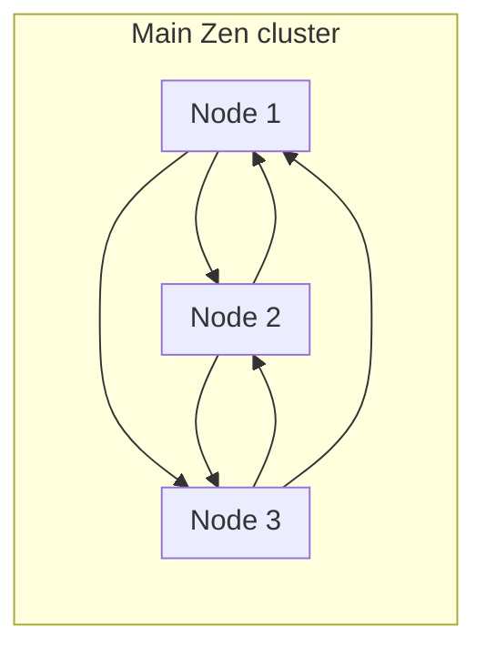

import ApiOperation from "@theme/ApiOperation";
import ApiSchema from "@theme/ApiSchema";

# Cluster
ZenBPM uses raft as its consensus algorithm. Zen cluster consists of:
- Main raft cluster serves the purpose of keeping track of the state of the cluster across multiple instances of the application. 
- RqLite cluster groups provide storage layer for the application.

## Main cluster

Instances of the application are connected through the internal GRPC api and when an event that concerns cluster state happens leader node is notified and updates the state of the cluster through raft.
The state of the cluster can be queried through the system API:

 - REST: `/system/status`
 - GRPC: TODO: add grpc endpoint as well

## Partition clusters
Partition clusters are smaller [RqLite](https://rqlite.io/) clusters created for data storage of each partition.

:::warning
Current theoretical limit for partitions is 122 due to network multiplexer implementation.
:::

:::note[Future plans]
You can specify how many partitions and partition replicas will be created through the [application configuration](/reference/configuration). After the cluster has been created you can modify these through [zenctl](/reference/zenctl) cli that is used to manage Zen clusters.
:::

:::note[Future plans]
You can query each partition database through the `zenctl` or public REST/GRPC API
:::

