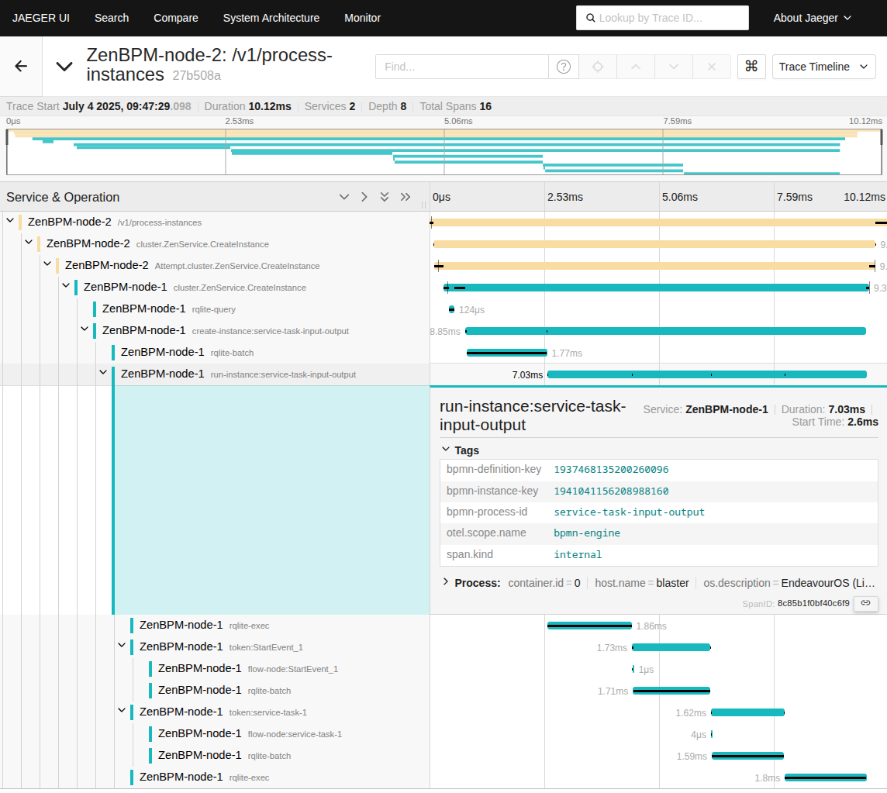

# OpenTelemetry
[OpenTelemetry](https://opentelemetry.io/) is a collection of APIs, SDKs, and tools to instrument, generate, collect, and export telemetry data (metrics, logs, and traces) that help us analyze application performance and behavior.

## Traces
We provide a tracing implementation as a means to gain view into the system performance and bottlenecks.
You can configure the collectors through [application configuration](/reference/configuration#tracing-configuration-tracing)
:::note[Future plans]
You can specify the custom headers that you want to transfer through the application.
:::

#### Example trace of the start of process instance

## Metrics
Metrics provide an insight into the platform over time.
We provide metrics such as:
 - request rates
 - request duration
 - error counts
 - memory usage
 - bpmn metrics
 - dmn metrics

They are are available at:
 - REST(prometheus exporter): `/system/metrics`

