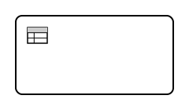

# Business Rule Task

A Business Rule Task delegates a decision to a rule engine instead of hard-coding the logic in the process flow. In ZenBPM, decisions are expressed as **DMN Decision Tables**.

## Key characteristics

- One incoming and one outgoing sequence flow.
- Evaluates a DMN decision and writes the result back as process variables.
- Separates business logic from process flow, making rules easy to update independently.

## How it works

1. The engine evaluates the referenced DMN decision using the current process variables as input.
2. The decision output is written back to the process instance as variables.
3. The token moves forward immediately — no external worker is needed.

## Graphical notation

A rounded rectangle with a table icon in the top-left corner.



## XML Definition

```xml
<bpmn:businessRuleTask id="calculateDiscount" name="Calculate discount">
  <bpmn:extensionElements>
    <zeebe:calledDecision decisionId="discount-rules" resultVariable="discountResult" />
  </bpmn:extensionElements>
  <bpmn:incoming>Flow_1</bpmn:incoming>
  <bpmn:outgoing>Flow_2</bpmn:outgoing>
</bpmn:businessRuleTask>
```

## Practical example

An order process uses a Business Rule Task to determine the discount based on customer type and order amount. The DMN table maps input conditions to a discount percentage, which is then applied to the order total.

| Customer type | Order amount | Discount |
|---|---|---|
| VIP | any | 20% |
| Regular | > 1000 | 10% |
| Regular | ≤ 1000 | 0% |

## Current Implementation

Supported through the built-in DMN engine. See the [DMN Engine reference](/reference/dmn) for supported decision table features.

