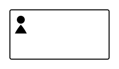

# User Task

A User Task represents work that must be completed by a human. The process instance pauses until a person submits the task result.

## Key characteristics

- One incoming and one outgoing sequence flow.
- Blocks the token until the task is completed via the API.
- Supports input/output variable mappings for data shown to and returned by the user.

## How it works

1. The engine creates a **user task** (a job of type `io.camunda.zeebe:userTask`) when the token arrives.
2. A task management application (or custom UI) lists open tasks for the appropriate assignee.
3. The user reviews the task, fills in any required data, and completes or rejects it.
4. The token moves forward with the user's output variables.

## Graphical notation

A rounded rectangle with a person icon in the top-left corner.



## XML Definition

```xml
<bpmn:userTask id="approvePurchase" name="Approve purchase request">
  <bpmn:extensionElements>
    <zeebe:assignmentDefinition assignee="manager" />
  </bpmn:extensionElements>
  <bpmn:incoming>Flow_1</bpmn:incoming>
  <bpmn:outgoing>Flow_2</bpmn:outgoing>
</bpmn:userTask>
```

## Practical example

A purchase approval process pauses at a User Task where a manager reviews the request. The manager approves or rejects it; the outcome variable routes the process through an exclusive gateway to the next step.

```
[Request submitted] → [Review request] → [Approved?] → Yes → [Place order]
                             ↑               ↓ No
                         Manager UI    [Notify requester]
```

## Current Implementation

Fully supported.

