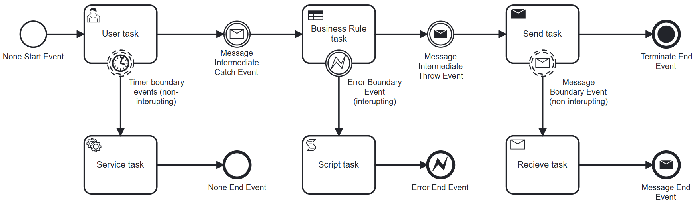

import DocCardList from '@theme/DocCardList';

# Events

An event represents something that happens during the course of a process. Events affect the flow of the process and usually have a cause (trigger) or an impact (result).

<DocCardList />

