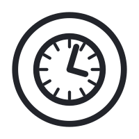

# Timer Start Event

A Timer Start Event starts a process instance automatically at a specific time, after a duration, or on a recurring schedule.

## Key characteristics

- The process instance is created automatically when the specified time condition is met.
- No manual trigger is required.
- Supports three timer types: date, duration, and cycle.

## Graphical notation

A thin single-line circle with a clock icon inside.



## Configuration

| Field    | Format                    | Example                  |
|----------|---------------------------|--------------------------|
| Date     | ISO 8601 datetime         | `2026-10-01T12:00:00Z`   |
| Duration | ISO 8601 duration         | `PT15S`, `P14D`          |
| Cycle    | ISO 8601 repeat or cron   | `R5/PT10S`               |

## XML Definition

```xml
<bpmn:startEvent id="StartEvent_1" name="Start on schedule">
  <bpmn:outgoing>Flow_1</bpmn:outgoing>
  <bpmn:timerEventDefinition id="TimerEventDefinition_1">
    <bpmn:timeCycle xsi:type="bpmn:tFormalExpression">R/PT1H</bpmn:timeCycle>
  </bpmn:timerEventDefinition>
</bpmn:startEvent>
```

## Current Implementation

Supported.

